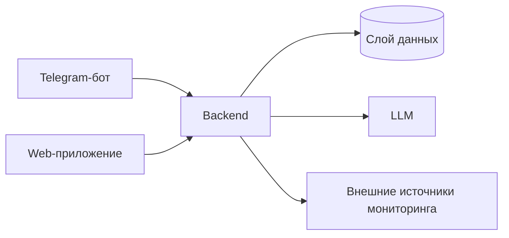

# TG Maintenance Bot
Система мониторинга состояния оборудования для инженеров, операторов и ответственных за эксплуатацию.

## О проекте
Производственным командам сложно быстро понимать текущее состояние оборудования и приоритеты реакции.  
Проект решает это через единое backend-ядро с клиентами в Telegram и Web.  
Ключевые пользователи: инженер, пользователь системы мониторинга и админ.

## Архитектура

## Статус
- 📋 Итерация 1: Backend foundation
- 📋 Итерация 2: Telegram MVP client
- 📋 Итерация 3: Web unified client
- 📋 Итерация 4: Monitoring and LLM integrations
- 📋 Итерация 5: Platform readiness

## Документация
- [Идея продукта](docs/idea.md)
- [Архитектурное видение](docs/vision.md)
- [Модель данных](docs/data-model.md)
- [Интеграции](docs/integrations.md)
- [План](docs/plan.md)
- [Задачи](docs/tasks/)

## Быстрый старт
Инструкция появится после реализации итерации 1.
