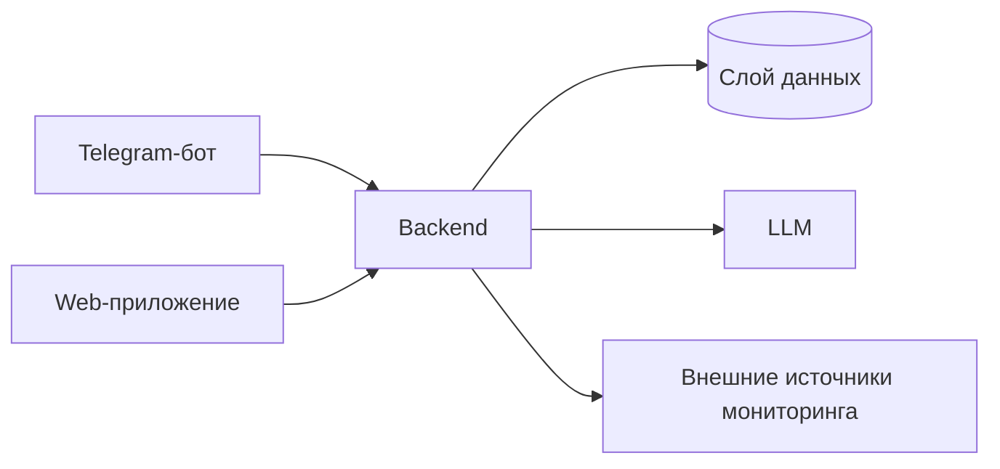

# TG Maintenance Bot
Система мониторинга состояния оборудования для инженеров, операторов и ответственных за эксплуатацию.

## О проекте
Производственным командам сложно быстро понимать текущее состояние оборудования и приоритеты реакции.  
Проект решает это через единое backend-ядро с клиентами в Telegram и Web.  
Ключевые пользователи: инженер, пользователь системы мониторинга и админ.

## Архитектура


## Статус
- ✅ Итерация 1: Backend foundation
- ✅ Итерация 2: Telegram MVP client
- 📋 Итерация 3: Web unified client
- 📋 Итерация 4: Monitoring and LLM integrations
- 📋 Итерация 5: Platform readiness

## Документация
- [Идея продукта](docs/idea.md)
- [Архитектурное видение](docs/vision.md)
- [Модель данных](docs/data-model.md)
- [Интеграции](docs/integrations.md)
- [План](docs/plan.md)
- [Задачи](docs/tasks/)

## Быстрый старт
Backend живёт в `backend/`, но поднимается из корня репозитория как отдельный процесс.

1. Создать окружение и установить зависимости: `make install`
2. Скопировать `.env.example` в `.env`
3. Заполнить минимум `TELEGRAM_BOT_TOKEN` и `BACKEND_DATABASE_URL`; для штатных LLM-ответов backend дополнительно задать `BACKEND_OPENROUTER_API_KEY`
4. Поднять PostgreSQL на URL из `BACKEND_DATABASE_URL`
5. Запустить backend: `make run-backend`
6. Запустить Telegram-бота в отдельном процессе: `make run`

Дополнительно для acceptance-check доступны алиасы:
- `make backend-run`
- `make backend-lint`
- `make backend-test`

После старта backend доступны:
- `http://127.0.0.1:8000/health`
- `http://127.0.0.1:8000/ready`
- `http://127.0.0.1:8000/docs`
- `http://127.0.0.1:8000/openapi.json`

`/docs` и `/openapi.json` — runtime-проекция текущего backend API. Hand-written source of truth для контракта хранится в `backend/docs/openapi.yaml`.

Если `BACKEND_OPENROUTER_API_KEY` не задан или OpenRouter недоступен, assistant flow вернёт деградированный fallback-ответ с `meta.fallback_used=true`.
При старте backend создаёт минимальную схему PostgreSQL и seed-справочник оборудования из `BACKEND_SEED_EQUIPMENT_IDS`.

`backend/.env.example` дублирует backend-only набор переменных как справочный файл. Основной локальный entrypoint для запуска из корня остаётся `.env.example`.

## Backend тесты

Запуск backend API-тестов:

```bash
make test-backend
```

Набор проверяет:
- `POST /api/v1/assistant/messages`
- `POST /api/v1/equipment-state-records`
- `/health` smoke-check
- `/ready` readiness-check

Тесты работают на in-process ASGI app и dependency overrides, поэтому реальные Telegram/OpenRouter ключи для этого набора не нужны.

## Проверка качества backend

- `make lint-backend`
- `make test-backend`
- `make backend-lint`
- `make backend-test`

Эти команды документируют текущий публичный интерфейс разработки для backend foundation и не требуют дополнительных make-целей сверх уже существующих.

Фиксация backend foundation в репозитории подтверждается следующими проверками:
- `make test-backend` -> `18 passed`
- `make test` -> `5 passed`
- локальный smoke-run backend с PostgreSQL и проверкой `GET /health`
- проверка business endpoint `POST /api/v1/assistant/messages`
- проверка runtime OpenAPI по `/openapi.json`

Процент покрытия отдельно не публикуется: в текущем репозитории не настроен `pytest-cov` или эквивалентный coverage tooling.

При HTTP-запросах backend пишет privacy-safe request logs: в них есть `chat_id` и размеры request/response, но нет текста переписки.

## Связка с Telegram-ботом

В итерации 2 Telegram-бот больше не вызывает LLM напрямую и работает только через backend API.

Последовательность локального запуска:

1. `make run-backend`
2. `make run`
3. Отправить сообщение боту в Telegram
4. Проверить assistant flow через backend endpoint `POST /api/v1/assistant/messages`

Bot runtime ожидает:
- `TELEGRAM_BOT_TOKEN`
- `BACKEND_URL` с default `http://127.0.0.1:8000`
- `BACKEND_TIMEOUT_SECONDS`

Если backend недоступен или вернул ошибку, бот отвечает единым сервисным сообщением и не пытается обходить backend прямым вызовом LLM.

## Проверка качества бота

- `make lint`
- `make test`
