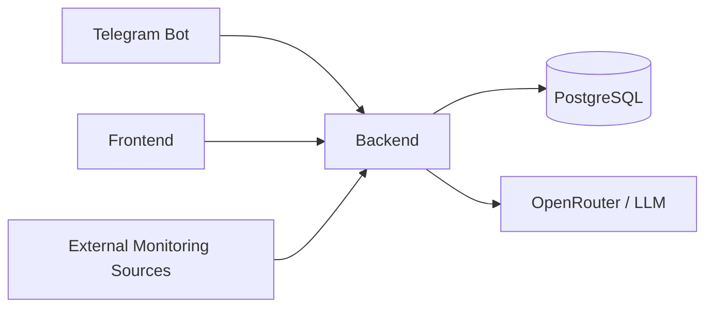
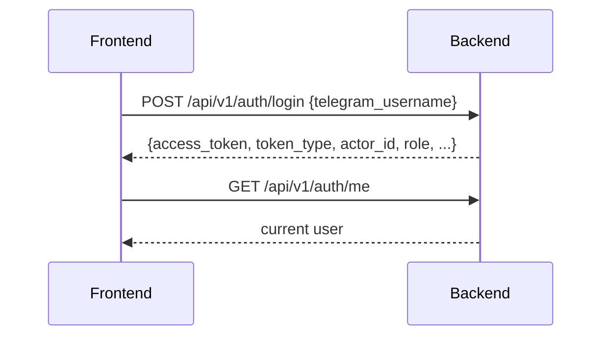
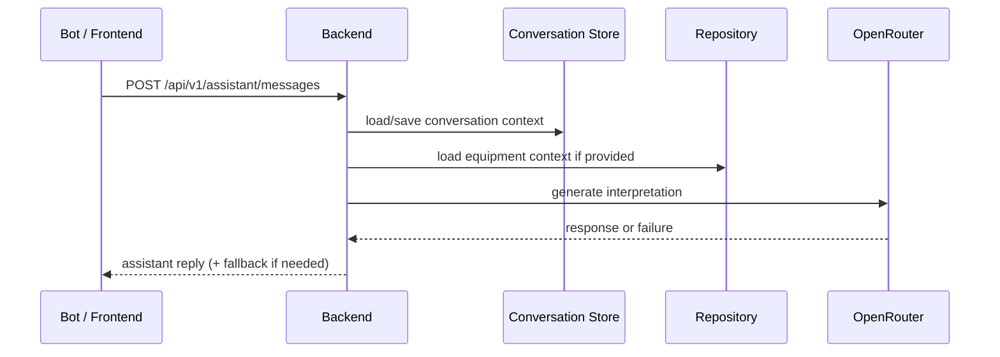
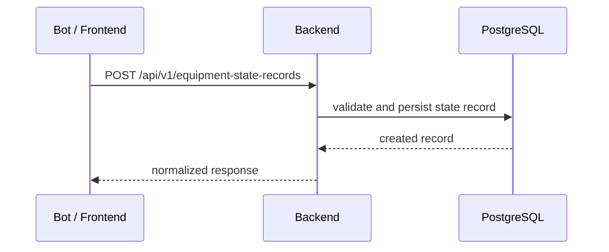
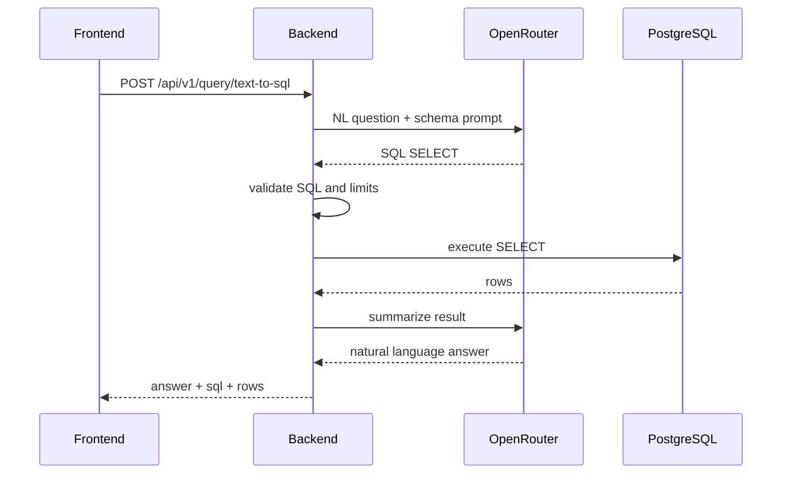

# Architecture

High-level архитектура системы мониторинга оборудования. Документ описывает runtime-компоненты, границы ответственности и основные потоки взаимодействия. Для продуктового видения используйте `docs/vision.md`, для интеграций — `docs/integrations.md`, для API-контрактов — `backend/docs/openapi.yaml` и `backend/docs/api-contracts.md`.

## Системный обзор

## Компоненты и границы ответственности

### Backend

- единое ядро системы на FastAPI;
- содержит API, бизнес-логику, persistence layer, auth, assistant flow и text-to-sql flow;
- кодовая точка входа: `backend/src/maintenance_backend/app.py`;
- composition versioned API: `backend/src/maintenance_backend/api/v1/router.py`.

### Frontend

- Next.js web-клиент для ролей инженера и администратора;
- использует backend API и не должен дублировать доменную логику;
- API layer находится в `frontend/src/lib/api`;
- маршруты и layouts находятся в `frontend/src/app`.

### Telegram Bot

- thin client поверх backend API;
- runtime entrypoint: `src/maintenance_bot/main.py`;
- получает update из Telegram и проксирует прикладные сценарии в backend.

### PostgreSQL

- основной persistence слой;
- используется backend для runtime data access, auth, истории состояний и аналитических запросов.

### OpenRouter / LLM

- используется backend-ом для assistant интерпретации и text-to-sql сценариев;
- не вызывается напрямую frontend-клиентом;
- Telegram-бот также не должен обходить backend прямым LLM-вызовом в штатной архитектуре.

## Runtime-потоки

### Auth flow

Фактический контракт:
- frontend сохраняет `access_token` как bearer token;
- затем использует `GET /api/v1/auth/me` для чтения текущего пользователя.

### Assistant flow

### State record flow

### Text-to-SQL flow

## Кодовые entrypoints

- `backend/src/maintenance_backend/app.py`
- `backend/src/maintenance_backend/api/v1/router.py`
- `src/maintenance_bot/main.py`
- `frontend/src/lib/api/client.ts`
- `frontend/src/lib/api/endpoints.ts`
- `frontend/src/lib/auth/context.tsx`

## Связанные документы

- `docs/vision.md` — продуктовое видение
- `docs/integrations.md` — внешние интеграции и риски
- `backend/docs/openapi.yaml` — API source of truth
- `backend/docs/api-contracts.md` — пояснения к API-контрактам
- `docs/data-model.md` — проектная модель данных и её границы
