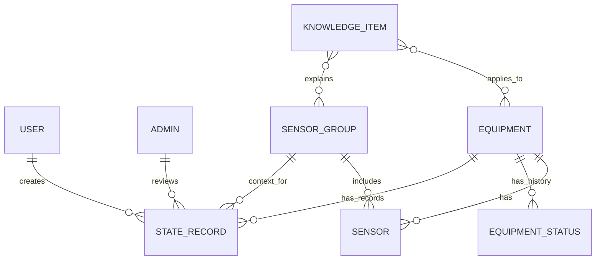

# Модель данных системы мониторинга оборудования

Документ фиксирует базовую доменную модель для MVP и дальнейшего развития.  
Уровень описания: продуктовый и архитектурный, без детализации API и схемы БД.

---

## Основные сущности

Ниже — минимальный набор для согласования.

### 1) Пользователь системы
- **Назначение:** работает с состоянием оборудования в своей зоне.
- **Ключевые поля:** идентификатор, ФИО/имя, роль, активность, привязка к участку/цеху.
- **Предполагаемые типы данных:** ID, строка, enum, boolean, ссылка.

### 2) Админ
- **Назначение:** управляет структурой мониторинга и контролирует общую картину.
- **Ключевые поля:** идентификатор, ФИО/имя, роль, уровень доступа, активность.
- **Предполагаемые типы данных:** ID, строка, enum, enum, boolean.

### 3) Единица оборудования
- **Назначение:** объект мониторинга (станок, линия, узел).
- **Ключевые поля:** идентификатор, название, код/инвентарный номер, локация (цех/участок), текущий статус.
- **Предполагаемые типы данных:** ID, строка, строка, ссылка, enum.

### 4) Датчик
- **Назначение:** источник измерений по конкретной единице оборудования.
- **Ключевые поля:** идентификатор, тип датчика, единица оборудования, текущий показатель, время последнего значения.
- **Предполагаемые типы данных:** ID, enum, ссылка, число/строка, datetime.

### 5) Группа датчиков
- **Назначение:** логическое объединение датчиков для совместного контроля.
- **Ключевые поля:** идентификатор, название группы, описание, список датчиков.
- **Предполагаемые типы данных:** ID, строка, строка, список ссылок.

### 6) Статус работы оборудования
- **Назначение:** фиксирует состояние оборудования в конкретный момент.
- **Ключевые поля:** идентификатор, единица оборудования, статус, причина/комментарий, время фиксации.
- **Предполагаемые типы данных:** ID, ссылка, enum, строка, datetime.

### 7) Результат фиксации состояния
- **Назначение:** результат наблюдения/оценки пользователем или системой.
- **Ключевые поля:** идентификатор, объект фиксации, автор, итог, комментарий, время фиксации.
- **Предполагаемые типы данных:** ID, ссылка, ссылка, enum/строка, строка, datetime.

### 8) FAQ / Knowledge Item
- **Назначение:** справочные материалы по типовым ситуациям и интерпретациям.
- **Ключевые поля:** идентификатор, вопрос/тема, ответ/рекомендация, применимость (к типу оборудования/датчика), актуальность.
- **Предполагаемые типы данных:** ID, строка, текст, ссылка/enum, boolean.

---

## Связи между сущностями

Ключевая логика связей:
- Оборудование — центральная сущность мониторинга.
- Датчики и группы датчиков формируют контекст оценки состояния.
- Статусы и фиксации состояния образуют историю сопровождения.
- Knowledge-блок помогает интерпретировать состояние и отклонения.

---

## Выбор СУБД

### MVP: PostgreSQL

Почему:
- реляционная модель хорошо подходит для ролей, оборудования, датчиков и истории;
- надёжно поддерживает связи и целостность данных;
- удобно масштабируется от простого MVP к production;
- даёт запас для расширения (JSON-поля, индексация, аналитические выборки).

### Дальнейшее развитие

Базовый выбор остаётся: **PostgreSQL как основная СУБД**.

При росте нагрузки и сервисов:
- сохранить PostgreSQL как единый источник транзакционных данных;
- при необходимости добавить специализированные хранилища рядом (например, для метрик/поиска), не заменяя основную реляционную модель.

---

Если под «сопровождением учебного потока» имелась в виду другая предметная область, уточни — адаптирую модель под неё в том же формате.
