# Physical ER: Database Schema

Этот документ содержит physical ER-диаграмму для core domain схемы из `docs/data-model.md`.

```mermaid
erDiagram
    SYSTEM_ACTORS ||--o{ EQUIPMENT : owns
    LOCATIONS ||--o{ LOCATIONS : parent_of
    LOCATIONS ||--o{ EQUIPMENT : contains

    DATA_SOURCES ||--o{ SENSORS : feeds
    DATA_SOURCES ||--o{ SENSOR_GROUPS : feeds
    EQUIPMENT ||--o{ SENSORS : has
    EQUIPMENT ||--o{ SENSOR_GROUPS : has

    SENSOR_GROUPS ||--o{ SENSOR_GROUP_MEMBERS : groups
    SENSORS ||--o{ SENSOR_GROUP_MEMBERS : members

    DATA_SOURCES ||--o{ EQUIPMENT_STATE_SNAPSHOTS : provides
    EQUIPMENT ||--o{ EQUIPMENT_STATE_SNAPSHOTS : has_state_history
    EQUIPMENT_STATE_SNAPSHOTS ||--o{ EQUIPMENT_STATE_SNAPSHOT_SENSORS : includes
    SENSORS ||--o{ EQUIPMENT_STATE_SNAPSHOT_SENSORS : used_in
    EQUIPMENT_STATE_SNAPSHOTS ||--o{ EQUIPMENT_STATE_SNAPSHOT_SENSOR_GROUPS : includes
    SENSOR_GROUPS ||--o{ EQUIPMENT_STATE_SNAPSHOT_SENSOR_GROUPS : used_in

    EQUIPMENT ||--o{ EQUIPMENT_STATE_RECORDS : has_records
    SYSTEM_ACTORS ||--o{ EQUIPMENT_STATE_RECORDS : authors
    SYSTEM_ACTORS ||--o{ EQUIPMENT_STATE_RECORDS : reviews
    EQUIPMENT_STATE_RECORDS ||--o{ EQUIPMENT_STATE_RECORD_SENSORS : references
    SENSORS ||--o{ EQUIPMENT_STATE_RECORD_SENSORS : context_for
    EQUIPMENT_STATE_RECORDS ||--o{ EQUIPMENT_STATE_RECORD_SENSOR_GROUPS : references
    SENSOR_GROUPS ||--o{ EQUIPMENT_STATE_RECORD_SENSOR_GROUPS : context_for

    KNOWLEDGE_ITEMS ||--o{ KNOWLEDGE_ITEM_EQUIPMENT_TYPES : applies_to
    KNOWLEDGE_ITEMS ||--o{ KNOWLEDGE_ITEM_SENSOR_TYPES : applies_to
    KNOWLEDGE_ITEMS ||--o{ KNOWLEDGE_ITEM_SENSOR_GROUP_TYPES : applies_to

    SYSTEM_ACTORS {
        text actor_id PK
        text external_id UK
        text role
        boolean is_active
    }
    LOCATIONS {
        text location_id PK
        text parent_location_id FK
        text location_type
        boolean is_active
    }
    EQUIPMENT {
        text equipment_id PK
        text location_id FK
        text owner_actor_id FK
        text current_status
        boolean is_active
    }
    DATA_SOURCES {
        text source_id PK
        text source_type
        boolean is_active
    }
    SENSORS {
        text sensor_id PK
        text equipment_id FK
        text data_source_id FK
        text sensor_type
        boolean is_active
    }
    SENSOR_GROUPS {
        text sensor_group_id PK
        text equipment_id FK
        text data_source_id FK
        text group_type
        boolean is_active
    }
    SENSOR_GROUP_MEMBERS {
        text sensor_group_id PK,FK
        text sensor_id PK,FK
    }
    EQUIPMENT_STATE_SNAPSHOTS {
        text snapshot_id PK
        text equipment_id FK
        text data_source_id FK
        text status
        timestamptz effective_at
    }
    EQUIPMENT_STATE_SNAPSHOT_SENSORS {
        text snapshot_id PK,FK
        text sensor_id PK,FK
    }
    EQUIPMENT_STATE_SNAPSHOT_SENSOR_GROUPS {
        text snapshot_id PK,FK
        text sensor_group_id PK,FK
    }
    EQUIPMENT_STATE_RECORDS {
        text record_id PK
        text equipment_id FK
        text author_actor_id FK
        text reviewed_by_actor_id FK
        text status
        text review_status
        text idempotency_key UK
    }
    EQUIPMENT_STATE_RECORD_SENSORS {
        text record_id PK,FK
        text sensor_id PK,FK
    }
    EQUIPMENT_STATE_RECORD_SENSOR_GROUPS {
        text record_id PK,FK
        text sensor_group_id PK,FK
    }
    KNOWLEDGE_ITEMS {
        text knowledge_item_id PK
        boolean is_active
    }
    KNOWLEDGE_ITEM_EQUIPMENT_TYPES {
        text knowledge_item_id PK,FK
        text equipment_type PK
    }
    KNOWLEDGE_ITEM_SENSOR_TYPES {
        text knowledge_item_id PK,FK
        text sensor_type PK
    }
    KNOWLEDGE_ITEM_SENSOR_GROUP_TYPES {
        text knowledge_item_id PK,FK
        text sensor_group_type PK
    }
```

## Key Cardinalities

- `locations -> equipment`: одна локация содержит много единиц оборудования; для каждой единицы `location_id` обязателен.
- `system_actors -> equipment`: owner у оборудования опционален на уровне схемы, но обязателен как целевое data requirement для admin-view.
- `equipment -> sensors` и `equipment -> sensor_groups`: каждая точка мониторинга принадлежит ровно одной единице оборудования.
- `sensor_groups <-> sensors`: many-to-many через `sensor_group_members`.
- `equipment -> equipment_state_snapshots`: snapshot всегда относится к одному equipment и одному `data_source`.
- `equipment -> equipment_state_records`: record всегда относится к одному equipment и одному author; reviewer опционален до момента review.
- snapshot и record context к датчикам и группам нормализованы через отдельные join tables, а не через JSON/array поля.

## Required vs Optional Links

- Обязательные связи:
  - `equipment.location_id`
  - `sensors.equipment_id`
  - `sensor_groups.equipment_id`
  - `equipment_state_snapshots.equipment_id`
  - `equipment_state_snapshots.data_source_id`
  - `equipment_state_records.equipment_id`
  - `equipment_state_records.author_actor_id`
- Опциональные связи:
  - `locations.parent_location_id`
  - `equipment.owner_actor_id`
  - `sensors.data_source_id`
  - `sensor_groups.data_source_id`
  - `equipment_state_records.reviewed_by_actor_id`
  - sensor/group context для конкретного snapshot или record
