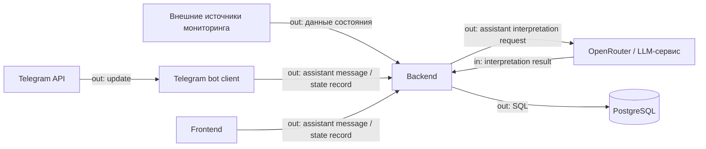
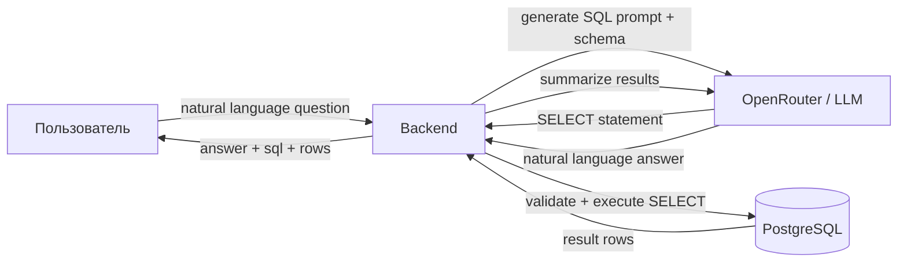

# Внешние интеграции системы

## Внешние системы



| Интеграция | Название и ссылка на сервис | Назначение в продукте | Направление | Протокол / способ интеграции | Критичность |
|---|---|---|---|---|---|
| Источники мониторинга | Внешние системы мониторинга (внутренние/сторонние) | Поставка фактических данных о состоянии оборудования и датчиков | in | API/коннекторы backend (формат определяется контрактом источника) | MVP |
| LLM-сервис | [OpenRouter](https://openrouter.ai/) | Интерпретация состояния и отклонений на понятном языке только из assistant flow backend-а | bidirectional | HTTPS API для `POST /api/v1/assistant/messages` (backend -> LLM, ответ LLM -> backend) | MVP |
| Telegram-платформа | [Telegram Bot API](https://core.telegram.org/bots/api) | Пользовательский канал быстрых запросов, где bot получает update и вызывает backend-контракты от имени пользователя | bidirectional | HTTPS через Telegram Bot API на стороне bot-клиента и HTTPS/JSON API между bot и backend | MVP |
| Frontend | Веб-приложение системы | Интерфейс для админа и пользователя, работающий через те же backend-контракты | bidirectional | HTTPS/JSON API между frontend и backend | MVP |
| СУБД | [PostgreSQL](https://www.postgresql.org/) | Хранение состояния, истории и результатов фиксации | out | SQL (драйвер/ORM backend) | MVP |

## Контрактные потоки MVP

- `POST /api/v1/assistant/messages`: thin client передаёт сообщение пользователя, backend собирает контекст диалога и при необходимости обращается к LLM.
- `POST /api/v1/equipment-state-records`: thin client передаёт ручную фиксацию состояния оборудования, backend валидирует наличие `equipment_id` в PostgreSQL, поддерживает idempotency по `idempotency_key` и сохраняет запись без вызова LLM как обязательной части сценария.
- Telegram bot использует поток `Telegram Bot API -> bot client -> backend -> LLM`; прямой вызов LLM из bot runtime исключён.
- И bot, и frontend используют одинаковые DTO и единый error-shape; прямой вызов LLM из клиентов не является целевой архитектурой.
- В локальной dev-среде клиенты обращаются к backend по базовому URL `http://127.0.0.1:8000`.
- Для frontend/backend уже реализована временная auth-схема через `POST /api/v1/auth/login` по `telegram_username` и дальнейший `Authorization: Bearer {access_token}` на защищённых endpoint'ах.
- Telegram-бот работает как service client поверх `BACKEND_URL` и не использует тот же frontend auth flow.
- OpenAPI публикуется runtime-эндпоинтами `GET /docs` и `GET /openapi.json`, а hand-written спецификация хранится в `backend/docs/openapi.yaml`.
- `GET /ready`: operational endpoint для проверки доступности PostgreSQL; `GET /health` остаётся liveness endpoint без тяжёлых зависимостей.

## Зависимости и риски

- Критично для MVP: источники мониторинга, PostgreSQL, Telegram Bot API, OpenRouter.
- Главная внешняя зависимость: стабильность и контракт данных источников мониторинга; при изменениях формата нужны адаптеры.
- Риск внешнего LLM: задержки, лимиты, стоимость, временная недоступность; нужен fallback-текст без интерпретации.
- Риск БД: без доступного PostgreSQL backend не готов к записи состояния и должен сигнализировать это через readiness.
- Риск Telegram-канала: ограничения API и сетевые сбои; нужен повтор доставки и базовый мониторинг ошибок.
- Для frontend ключевой риск — рассинхрон контрактов frontend/backend; важна единая версия API.

## Голосовой ввод (Voice Chat)

Оба канала поддерживают ввод голосом. Транскрибированный текст передаётся в тот же endpoint `POST /api/v1/assistant/messages`.

| Канал | Технология | Модель | Детали |
|---|---|---|---|
| Web-клиент | Web Speech API (браузерная, нативная) | встроенная в браузер | `window.SpeechRecognition` / `window.webkitSpeechRecognition`, язык `ru-RU`, клиент-сайд, не требует API-ключа |
| Telegram bot | OpenAI Whisper API | `whisper-1` | Голосовое сообщение (`.ogg`) скачивается из Telegram, отправляется в Whisper через `OPENAI_API_KEY` / `OPENAI_BASE_URL`, транскрипт отправляется в backend |

### Конфигурация голоса для Telegram-бота

Добавить в `.env`:
```
OPENAI_API_KEY=<your-key>          # ключ OpenAI или OpenRouter
OPENAI_BASE_URL=https://openrouter.ai/api/v1   # по умолчанию; для прямого OpenAI убрать
WHISPER_MODEL=whisper-1            # по умолчанию
```

Если `OPENAI_API_KEY` не задан, бот отвечает пользователю сообщением о недоступности голосового ввода и не падает.

## Text-to-SQL (Аналитические запросы на естественном языке)



### Endpoint

`POST /api/v1/query/text-to-sql` — требует `Authorization: Bearer {access_token}`.

### Поток

1. Клиент отправляет вопрос на естественном языке.
2. Backend передаёт вопрос + схему БД в LLM → получает SQL SELECT.
3. SQL проходит валидацию безопасности (только SELECT, blocklist мутаций).
4. SELECT выполняется против БД с таймаутом 5 сек и лимитом 100 строк.
5. Результаты передаются в LLM для формирования краткого ответа.
6. Клиент получает: текстовый ответ, использованный SQL, табличные данные.

### Гарантии безопасности

- Только SELECT-запросы; INSERT/UPDATE/DELETE/DROP/ALTER/TRUNCATE/CREATE/GRANT/REVOKE отклоняются.
- Таймаут запроса: 5 секунд.
- Максимум 100 строк в результате.
- Генерация SQL выполняется только backend-ом; клиент не передаёт SQL напрямую.
