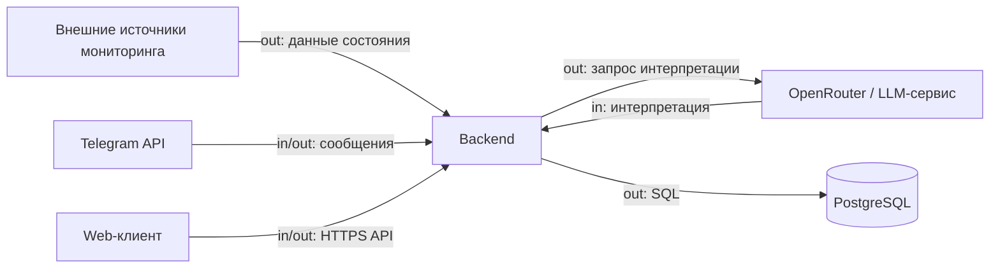

# Внешние интеграции системы

## Внешние системы

| Интеграция | Название и ссылка на сервис | Назначение в продукте | Направление | Протокол / способ интеграции | Критичность |
|---|---|---|---|---|---|
| Источники мониторинга | Внешние системы мониторинга (внутренние/сторонние) | Поставка фактических данных о состоянии оборудования и датчиков | in | API/коннекторы backend (формат определяется контрактом источника) | MVP |
| LLM-сервис | [OpenRouter](https://openrouter.ai/) | Интерпретация состояния и отклонений на понятном языке | bidirectional | HTTPS API (backend -> LLM, ответ LLM -> backend) | MVP |
| Telegram-платформа | [Telegram Bot API](https://core.telegram.org/bots/api) | Пользовательский канал быстрых запросов и ответов | bidirectional | HTTPS через Telegram Bot API (webhook или polling) | MVP |
| Web-клиент | Веб-приложение системы | Интерфейс для админа и пользователя, работа с мониторингом | bidirectional | HTTPS/JSON API между web и backend | MVP |
| СУБД | [PostgreSQL](https://www.postgresql.org/) | Хранение состояния, истории и результатов фиксации | out | SQL (драйвер/ORM backend) | MVP |

## Зависимости и риски

- Критично для MVP: источники мониторинга, PostgreSQL, Telegram Bot API, OpenRouter.
- Главная внешняя зависимость: стабильность и контракт данных источников мониторинга; при изменениях формата нужны адаптеры.
- Риск внешнего LLM: задержки, лимиты, стоимость, временная недоступность; нужен fallback-текст без интерпретации.
- Риск Telegram-канала: ограничения API и сетевые сбои; нужен повтор доставки и базовый мониторинг ошибок.
- Для web-клиента ключевой риск — рассинхрон контрактов frontend/backend; важна единая версия API.
