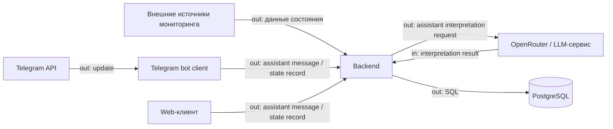

# Внешние интеграции системы

## Внешние системы

| Интеграция | Название и ссылка на сервис | Назначение в продукте | Направление | Протокол / способ интеграции | Критичность |
|---|---|---|---|---|---|
| Источники мониторинга | Внешние системы мониторинга (внутренние/сторонние) | Поставка фактических данных о состоянии оборудования и датчиков | in | API/коннекторы backend (формат определяется контрактом источника) | MVP |
| LLM-сервис | [OpenRouter](https://openrouter.ai/) | Интерпретация состояния и отклонений на понятном языке только из assistant flow backend-а | bidirectional | HTTPS API для `POST /api/v1/assistant/messages` (backend -> LLM, ответ LLM -> backend) | MVP |
| Telegram-платформа | [Telegram Bot API](https://core.telegram.org/bots/api) | Пользовательский канал быстрых запросов, где bot получает update и вызывает backend-контракты от имени пользователя | bidirectional | HTTPS через Telegram Bot API на стороне bot-клиента и HTTPS/JSON API между bot и backend | MVP |
| Web-клиент | Веб-приложение системы | Интерфейс для админа и пользователя, работающий через те же backend-контракты | bidirectional | HTTPS/JSON API между web и backend | MVP |
| СУБД | [PostgreSQL](https://www.postgresql.org/) | Хранение состояния, истории и результатов фиксации | out | SQL (драйвер/ORM backend) | MVP |

## Контрактные потоки MVP

- `POST /api/v1/assistant/messages`: thin client передаёт сообщение пользователя, backend собирает контекст диалога и при необходимости обращается к LLM.
- `POST /api/v1/equipment-state-records`: thin client передаёт ручную фиксацию состояния оборудования, backend валидирует наличие `equipment_id` в PostgreSQL, поддерживает idempotency по `idempotency_key` и сохраняет запись без вызова LLM как обязательной части сценария.
- Telegram bot использует поток `Telegram Bot API -> bot client -> backend -> LLM`; прямой вызов LLM из bot runtime исключён.
- И bot, и будущий web используют одинаковые DTO и единый error-shape; прямой вызов LLM из клиентов не является целевой архитектурой.
- В локальной dev-среде клиенты обращаются к backend по базовому URL `http://127.0.0.1:8000`.
- Для MVP аутентификация между thin clients и backend пока не вводится; её появление относится к следующим итерациям и должно быть отражено отдельным обновлением контрактов.
- OpenAPI публикуется runtime-эндпоинтами `GET /docs` и `GET /openapi.json`, а hand-written спецификация хранится в `backend/docs/openapi.yaml`.
- `GET /ready`: operational endpoint для проверки доступности PostgreSQL; `GET /health` остаётся liveness endpoint без тяжёлых зависимостей.

## Зависимости и риски

- Критично для MVP: источники мониторинга, PostgreSQL, Telegram Bot API, OpenRouter.
- Главная внешняя зависимость: стабильность и контракт данных источников мониторинга; при изменениях формата нужны адаптеры.
- Риск внешнего LLM: задержки, лимиты, стоимость, временная недоступность; нужен fallback-текст без интерпретации.
- Риск БД: без доступного PostgreSQL backend не готов к записи состояния и должен сигнализировать это через readiness.
- Риск Telegram-канала: ограничения API и сетевые сбои; нужен повтор доставки и базовый мониторинг ошибок.
- Для web-клиента ключевой риск — рассинхрон контрактов frontend/backend; важна единая версия API.
