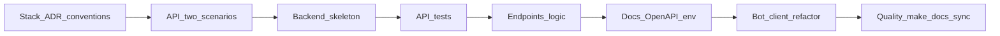

# Backend Tasklist

## Обзор

Backend — единое ядро системы мониторинга: через него проходят клиентские каналы (Telegram, далее Web) и интеграции. Этот tasklist описывает **этап foundation**: выбор стека и соглашений, проектирование **двух базовых API-сценариев** (вопрос ассистенту и фиксация состояния оборудования), каркас сервиса, тесты, реализация endpoint’ов и логики, документация (в т.ч. OpenAPI и окружение), рефакторинг бота на вызовы backend API и базовое качество.

После закрытия foundation backend дополнительно прошёл database stage из `docs/tasks/tasklist-database.md`: локальный PostgreSQL lifecycle, Alembic migrations, import/seed workflow и перевод runtime persistence на `SQLAlchemy AsyncSession + repositories` уже реализованы и проверены.

Глубокое подключение внешних источников мониторинга, полная схема хранения и platform/governance в широком смысле — по [docs/plan.md](../plan.md) в последующих итерациях и в отдельных tasklist’ах (например `tasklist-platform.md`, когда появится).

## Рекомендации по skills

На этапах **выбора стека** и **проектирования API** уместно подключать специализированные skills (REST/OpenAPI, FastAPI, async Python, тестирование и т.д.). Подбор: искать через команду **`/find-skills`** в Cursor; применять по необходимости, без раздувания scope задачи.

## Связь с plan.md

| Итерация [plan.md](../plan.md) | Как отражена в этом tasklist |
|--------------------------------|------------------------------|
| **0 — Backend bootstrap** | Задача 01: стек, ADR, conventions и фиксация backend-first инженерных правил до старта API-работ. |
| **1 — Backend foundation** | Задачи 02–06 и 08: контракты, каркас, тесты, реализация, документация backend и финальная quality/docs sync. План: [plan](impl/backend/iteration-1-backend-foundation/plan.md) \| Summary: [summary](impl/backend/iteration-1-backend-foundation/summary.md). |
| **2 — Telegram MVP client** | Задача 07: бот как клиент backend API поверх готового backend foundation. План: [plan](impl/backend/iteration-2-telegram-mvp-client/plan.md) \| Summary: [summary](impl/backend/iteration-2-telegram-mvp-client/summary.md). |
| **4–5 — Интеграции / platform** | Не входят в нумерацию 01–08 здесь; при появлении новых команд запуска и проверок — **дополнять Makefile** в рамках соответствующих задач или platform-tasklist. |

## Легенда статусов

- 📋 Planned — запланирован
- 🚧 In Progress — в работе
- ✅ Done — завершён

## Список задач

| Задача | Описание | Статус | Документы |
|--------|----------|--------|-----------|
| 01 | Стек, ADR, обновление conventions под backend | ✅ Done | [plan](impl/backend/iteration-0-backend-bootstrap/tasks/task-01-backend-stack-conventions/plan.md) \| [summary](impl/backend/iteration-0-backend-bootstrap/tasks/task-01-backend-stack-conventions/summary.md) |
| 02 | API-контракты: вопрос ассистенту и фиксация состояния оборудования | ✅ Done | [plan](impl/backend/iteration-1-backend-foundation/tasks/task-02-api-contracts-two-scenarios/plan.md) \| [summary](impl/backend/iteration-1-backend-foundation/tasks/task-02-api-contracts-two-scenarios/summary.md) |
| 03 | Каркас backend-сервиса, конфиг, make-цели | ✅ Done | [plan](impl/backend/iteration-1-backend-foundation/tasks/task-03-backend-skeleton/plan.md) \| [summary](impl/backend/iteration-1-backend-foundation/tasks/task-03-backend-skeleton/summary.md) |
| 04 | Базовые API-тесты (сценарии как у текущего бота + фиксация по контракту) | ✅ Done | [plan](impl/backend/iteration-1-backend-foundation/tasks/task-04-api-tests-baseline/plan.md) \| [summary](impl/backend/iteration-1-backend-foundation/tasks/task-04-api-tests-baseline/summary.md) |
| 05 | Реализация endpoint’ов и серверной логики | ✅ Done | [plan](impl/backend/iteration-1-backend-foundation/tasks/task-05-api-implementation/plan.md) \| [summary](impl/backend/iteration-1-backend-foundation/tasks/task-05-api-implementation/summary.md) |
| 06 | Документация backend: запуск, env, OpenAPI, команды | ✅ Done | [plan](impl/backend/iteration-1-backend-foundation/tasks/task-06-backend-documentation/plan.md) \| [summary](impl/backend/iteration-1-backend-foundation/tasks/task-06-backend-documentation/summary.md) |
| 07 | Рефакторинг бота: работа через backend API | ✅ Done | [plan](task-07-bot-backend-client/plan.md) \| [summary](task-07-bot-backend-client/summary.md) |
| 08 | Качество, инженерные практики, синхронизация проектной документации | ✅ Done | [plan](task-08-quality-and-docs-sync/plan.md) \| [summary](task-08-quality-and-docs-sync/summary.md) |

## Прогресс итерации 1

- Статус итерации: ✅ Done
- План итерации: [docs/tasks/impl/backend/iteration-1-backend-foundation/plan.md](impl/backend/iteration-1-backend-foundation/plan.md)
- Summary итерации: [docs/tasks/impl/backend/iteration-1-backend-foundation/summary.md](impl/backend/iteration-1-backend-foundation/summary.md)
- Выполнено: задачи 02, 03, 04, 05, 06 и 08.
- Итерация 1 закрыта; task 08 закрепляет quality-baseline и docs sync без переноса в platform.
- Проверка завершения подтверждена вручную: `make backend-lint` и `make backend-test` зелёные; live-run через Docker PostgreSQL подтвердил JSON `404` и privacy-safe request logging.
- Сохранённые артефакты итерации находятся в `docs/tasks/impl/backend/iteration-1-backend-foundation/`.

## Прогресс итерации 2

- Статус итерации: ✅ Done
- План итерации: [docs/tasks/impl/backend/iteration-2-telegram-mvp-client/plan.md](impl/backend/iteration-2-telegram-mvp-client/plan.md)
- Summary итерации: [docs/tasks/impl/backend/iteration-2-telegram-mvp-client/summary.md](impl/backend/iteration-2-telegram-mvp-client/summary.md)
- Выполнено: задача 07.
- Итерация 2 закрыта; Telegram-бот переведён на backend API как thin client поверх backend foundation.
- Сохранённые артефакты итерации находятся в `docs/tasks/impl/backend/iteration-2-telegram-mvp-client/`.

## Acceptance Snapshot

- `tasklist-backend`: актуализирован.
- `api-contract.md`: создан как `backend/docs/api-contracts.md`.
- backend skeleton: поднят.
- базовый API flow: реализован.

### Проверка интеграции и качества

- клиент подключён к backend: ✅
- smoke tests: ✅ `18` backend API tests + `5` bot integration/unit tests; coverage: `N/A`, в репозитории не настроено измерение покрытия
- PostgreSQL integration tests: ✅ `6` backend persistence/integration tests на реальной мигрированной схеме
- OpenAPI проверен: ✅

### Проверка перед фиксацией

- backend поднимается локально при валидном `BACKEND_DATABASE_URL` и доступном PostgreSQL.
- полезные endpoint'ы подтверждены через `GET /health` и `POST /api/v1/assistant/messages`.
- persistence flow подтверждён через `POST /api/v1/equipment-state-records`, прямую SQL-проверку и restart backend без потери данных.
- runtime OpenAPI доступен по `/openapi.json` и содержит `/health`, `/ready`, `/api/v1/assistant/messages`, `/api/v1/equipment-state-records`.
- `.env` не попадает в git: файл игнорируется и не является tracked-артефактом репозитория.

## Актуальный runtime status

- Backend runtime использует PostgreSQL как основной persistence layer для `equipment`, `system_actors` и `equipment_state_records`.
- Schema lifecycle переведён на Alembic; runtime `ensure_schema()` больше не является supported workflow.
- Ready-check использует реальную DB connectivity, а backend quality baseline теперь включает integration прогон на PostgreSQL.
- Единственное in-memory хранилище, оставшееся в backend, это TTL store для assistant conversations; оно не относится к persistence scope текущего database stage.

---

## Задача 01: Стек, ADR, conventions ✅

Связь с итерацией:
- **Итерация 0 — Backend bootstrap**
- План итерации: [docs/tasks/impl/backend/iteration-0-backend-bootstrap/plan.md](impl/backend/iteration-0-backend-bootstrap/plan.md)
- Summary итерации: [docs/tasks/impl/backend/iteration-0-backend-bootstrap/summary.md](impl/backend/iteration-0-backend-bootstrap/summary.md)

### Цель

Зафиксировать backend-стек MVP, ключевое решение в ADR и обновить правила проекта под новый стек.

### Состав работ

- [x] Согласовать runtime, фреймворк HTTP API и минимальные зависимости (в духе Python 3.12+, uv, make из vision/conventions).
- [x] Оформить ADR: аргументы, ограничения, границы ответственности backend.
- [x] Обновить [.cursor/rules/conventions.mdc](../../../.cursor/rules/conventions.mdc) под фактический стек и структуру репозитория.
- [x] **Актуализация документов (по необходимости):** [docs/vision.md](../vision.md) (ссылка на ADR / архитектурный акцент), [docs/plan.md](../plan.md) (статус/артефакты итерации 0 при существенных изменениях).

### Артефакты

- `docs/adr/adr-002-backend-stack.md` — стек и границы backend.
- `.cursor/rules/conventions.mdc` — соглашения под новый стек.
- `docs/tasks/impl/backend/iteration-0-backend-bootstrap/tasks/task-01-backend-stack-conventions/plan.md`
- `docs/tasks/impl/backend/iteration-0-backend-bootstrap/tasks/task-01-backend-stack-conventions/summary.md`

### Документы

- 📋 [План](impl/backend/iteration-0-backend-bootstrap/tasks/task-01-backend-stack-conventions/plan.md)
- 📝 [Summary](impl/backend/iteration-0-backend-bootstrap/tasks/task-01-backend-stack-conventions/summary.md)

### Definition of Done — агент

- Выбран и описан стек; ADR создан и согласуется с backend-first из vision.
- `conventions.mdc` отражает стек, инструменты и ожидаемую структуру (в т.ч. `backend/` при появлении).
- Ссылки из vision/plan на решение не противоречат тексту ADR.

### Definition of Done — пользователь

- Прочитать ADR и обновлённые conventions (корень репозитория: `.cursor/rules/conventions.mdc`): понятно, на чём пишется backend и какие команды ожидаются.
- При необходимости — просмотреть правки в `vision.md` / `plan.md`.

### Проверка после задачи

- **Агент:** убедиться, что путь к ADR и номер согласованы с `docs/adr/README.md`, нет дублирования противоречащих решений.
- **Пользователь:** открыть ADR и `.cursor/rules/conventions.mdc`; убедиться, что формулировки совпадают с договорённостями.
- **Команды:** при появлении новых — зафиксировать в следующей задаче в Makefile (`make …`).
- **Где результат:** `docs/adr/`, корневой `.cursor/rules/conventions.mdc`, при правках — `docs/vision.md`, `docs/plan.md`.

---

## Задача 02: API-контракты двух сценариев ✅

Связь с итерацией:
- **Итерация 1 — Backend foundation**

### Цель

Спроектировать и задокументировать контракты для **вопроса ассистенту** (аналог текущего LLM-диалога в боте) и **фиксации состояния мониторимого оборудования**.

### Состав работ

- [x] Описать ресурсы, методы HTTP, схемы запрос/ответ и базовую модель ошибок для обоих сценариев.
- [x] Согласовать идентификаторы сущностей с доменом (оборудование, фиксация, при необходимости пользователь/канал) — опора на [docs/data-model.md](../data-model.md).
- [x] Зафиксировать, как backend взаимодействует с LLM и клиентами на уровне контрактов — обновить [docs/integrations.md](../integrations.md) (направление backend ↔ LLM ↔ Telegram/Web).
- [x] **Актуализация документов:** [docs/data-model.md](../data-model.md) (термины и поля, если уточнялись для API), [docs/integrations.md](../integrations.md); при сдвиге рамок итерации — точечно [docs/plan.md](../plan.md).

### Артефакты

- `backend/docs/openapi.yaml` — OpenAPI-first контракт двух сценариев.
- `backend/docs/api-contracts.md` — краткое текстовое описание сценариев и допущений.
- `docs/tasks/impl/backend/iteration-1-backend-foundation/tasks/task-02-api-contracts-two-scenarios/plan.md`
- `docs/tasks/impl/backend/iteration-1-backend-foundation/tasks/task-02-api-contracts-two-scenarios/summary.md`

### Документы

- 📋 [План](impl/backend/iteration-1-backend-foundation/tasks/task-02-api-contracts-two-scenarios/plan.md)
- 📝 [Summary](impl/backend/iteration-1-backend-foundation/tasks/task-02-api-contracts-two-scenarios/summary.md)

### Definition of Done — агент

- Оба сценария имеют однозначные endpoint’ы, тела запросов/ответов и коды ошибок для типовых случаев.
- Документы data-model и integrations согласованы с контрактами без противоречий vision.

### Definition of Done — пользователь

- Можно пройти по документу контрактов и понять, как бот и будущий web вызовут backend для двух сценариев.
- `data-model.md` и `integrations.md` отражают согласованные границы.

### Проверка после задачи

- **Агент:** чеклист соответствия полей контрактов сущностям из data-model; отсутствие «висящих» внешних интеграций без упоминания в integrations.
- **Пользователь:** прочитать контракты и обновлённые фрагменты `data-model.md`, `integrations.md`.
- **Команды:** не обязательны; OpenAPI хранится как hand-written спецификация до появления backend-каркаса.
- **Где результат:** файл(ы) контрактов в репозитории, `docs/data-model.md`, `docs/integrations.md`.

---

### Итог блока 01–02: стек и контракты

| | |
|--|--|
| **Агент** | ADR и conventions согласованы; контракты двух сценариев полные; data-model и integrations обновлены там, где менялись границы. |
| **Пользователь** | Просмотреть ADR, conventions, документ контрактов, правки в `data-model.md` / `integrations.md`. |
| **Команды** | При появлении — `make lint` / проверки из репозитория; новые цели — добавлять в Makefile по мере введения backend. |
| **Результат** | Готовая основа для каркаса сервиса без разработки кода endpoint’ов. |

---

## Задача 03: Каркас backend-сервиса ✅

Связь с итерацией:
- **Итерация 1 — Backend foundation**

### Цель

Поднять минимальный работоспособный каркас backend (структура модулей, конфиг, точка входа, цели make).

### Состав работ

- [x] Создать дерево `backend/` (или согласованное с ADR имя пакета), зависимости в корневом `pyproject.toml` / workspace.
- [x] Подключить конфигурацию через переменные окружения (pydantic-settings или эквивалент), базовый lifecycle приложения.
- [x] Добавить/обновить **Makefile**: цели для установки, запуска dev-сервера backend, линта backend (например `make run-backend`, `make lint-backend` — имена зафиксировать в summary задачи).
- [x] **Актуализация документов:** [README.md](../../README.md) (кратко: где лежит backend); черновик [`.env.example`](../../.env.example) при появлении переменных; при смене структуры репозитория — [docs/plan.md](../plan.md) / [docs/vision.md](../vision.md) при необходимости.

### Артефакты

- Каталог `backend/` с запускаемым приложением (даже с заглушечными маршрутами).
- `Makefile` — новые цели.
- `docs/tasks/impl/backend/iteration-1-backend-foundation/tasks/task-03-backend-skeleton/plan.md`
- `docs/tasks/impl/backend/iteration-1-backend-foundation/tasks/task-03-backend-skeleton/summary.md`

### Документы

- 📋 [План](impl/backend/iteration-1-backend-foundation/tasks/task-03-backend-skeleton/plan.md)
- 📝 [Summary](impl/backend/iteration-1-backend-foundation/tasks/task-03-backend-skeleton/summary.md)

### Definition of Done — агент

- Сервер стартует локально, конфиг читается из env; линтер проходит на добавленном коде.
- В Makefile перечислены актуальные команды для backend; дублирования с bot не ломают `make install`.

### Definition of Done — пользователь

- По README и `.env.example` можно поднять backend одной-двумя командами.

### Проверка после задачи

- **Агент:** `make …` (как зафиксировано) — сервер слушает порт; лог старта без необработанных исключений.
- **Пользователь:** выполнить команды из README; открыть при наличии `/health` или `/docs`.
- **Команды:** задокументированные в задаче `make`-цели; новые — только через Makefile.
- **Где результат:** `backend/`, `Makefile`, `README.md`, `.env.example`.

---

## Задача 04: Базовые API-тесты ✅

### Цель

Покрыть тестами сценарии **эквивалентные текущему боту** (сообщение → ответ ассистента через backend) и базовые кейсы **фиксации состояния** по контракту задачи 02 — без лишней интеграции с Telegram в этом слое.

### Состав работ

- [x] Настроить pytest (или выбранный раннер) для HTTP-клиента к тестовому приложению (TestClient / httpx ASGI).
- [x] Тесты «ассистент»: запрос согласно контракту; при необходимости мок LLM/OpenRouter.
- [x] Тесты фиксации состояния: успех и типовые ошибки валидации по контракту.
- [x] Добавить **make**-цель для прогона тестов backend (например `make test-backend`).
- [x] **Актуализация документов:** [README.md](../../README.md) (как запускать тесты); при изменении контрактов — синхронизация с артефактом контрактов из задачи 02.

### Артефакты

- `backend/tests/` — baseline API-тесты для backend.
- `docs/tasks/impl/backend/iteration-1-backend-foundation/tasks/task-04-api-tests-baseline/plan.md`
- `docs/tasks/impl/backend/iteration-1-backend-foundation/tasks/task-04-api-tests-baseline/summary.md`

### Документы

- 📋 [План](impl/backend/iteration-1-backend-foundation/tasks/task-04-api-tests-baseline/plan.md)
- 📝 [Summary](impl/backend/iteration-1-backend-foundation/tasks/task-04-api-tests-baseline/summary.md)

### Definition of Done — агент

- Тесты зелёные локально и не требуют реального Telegram; моки внешних вызовов предсказуемы.
- `make test-backend` (или принятое имя) запускает только релевантный набор.

### Definition of Done — пользователь

- Можно выполнить одну команду из README и увидеть успешный прогон тестов API.

### Проверка после задачи

- **Агент:** `make test-backend` и `make lint-backend` (если есть).
- **Пользователь:** запустить команду тестов из README.
- **Команды:** `make test-backend` — добавить/актуализировать в Makefile.
- **Где результат:** вывод pytest, файлы тестов.

---

## Задача 05: Реализация endpoint’ов и логики 📋

### Цель

Реализовать основные маршруты по контрактам: валидация входа, бизнес-логика, ответы и ошибки.

### Состав работ

- [ ] Реализовать endpoint’ы для **вопроса ассистенту** и **фиксации состояния**; согласовать с task 02.
- [ ] Для хранения: либо минимальный слой с **PostgreSQL** с учётом [ADR-001](../adr/adr-001-database.md) и [docs/vision.md](../vision.md), либо явно оговорённый **in-memory / stub** на этот этап — без расширения scope до полной интеграции внешних источников мониторинга (см. [docs/plan.md](../plan.md) итерации 4).
- [ ] Health/readiness при необходимости для оркестрации и задачи 08.
- [ ] **Актуализация документов:** [docs/data-model.md](../data-model.md) при появлении реальных полей в БД; [docs/integrations.md](../integrations.md) при изменении вызовов LLM; `.env.example` — новые переменные (БД, ключи API).

### Артефакты

- Код маршрутов, сервисов и адаптеров в `backend/`.
- `docs/tasks/impl/backend/iteration-1-backend-foundation/tasks/task-05-api-implementation/plan.md`
- `docs/tasks/impl/backend/iteration-1-backend-foundation/tasks/task-05-api-implementation/summary.md`

### Документы

- 📋 [План](impl/backend/iteration-1-backend-foundation/tasks/task-05-api-implementation/plan.md)
- 📝 [Summary](impl/backend/iteration-1-backend-foundation/tasks/task-05-api-implementation/summary.md)

### Definition of Done — агент

- Поведение соответствует контрактам; тесты из задачи 04 проходят или обновлены осознанно.
- Ошибки и коды ответов согласованы с проектированием задачи 02.

### Definition of Done — пользователь

- Через HTTP-клиент или Swagger можно выполнить оба сценария на локальном стенде.

### Проверка после задачи

- **Агент:** полный прогон `make test-backend`; ручной curl/httpie к endpoint’ам; проверка логов при ошибках.
- **Пользователь:** сценарии из README / OpenAPI; сравнение ответов с ожиданиями контрактов.
- **Команды:** `make run-backend`, `make test-backend`, при необходимости миграции БД — зафиксировать в Makefile.
- **Где результат:** работающие endpoint’ы, зелёные тесты, обновлённый `.env.example`.

---

### Итог блока 03–05: каркас, тесты, реализация

| | |
|--|--|
| **Агент** | Backend поднимается; тесты API зелёные; реализация закрывает контракты; Makefile содержит run/test/lint для backend. |
| **Пользователь** | Поднять сервис, прогнать тесты, вызвать оба сценария из документации или OpenAPI. |
| **Команды** | `make run-backend`, `make test-backend`, `make lint-backend` (как принято в репозитории). |
| **Результат** | Готовое ядро для подключения бота и документирования внешнего контракта. |

---

## Задача 06: Документация backend ✅

### Цель

Задокументировать запуск, переменные окружения, OpenAPI и команды для разработчиков и агентов.

### Состав работ

- [x] Обновить [README.md](../../README.md): последовательность запуска backend (и при необходимости в связке с bot), переменные окружения.
- [x] Актуализировать [`.env.example`](../../.env.example) полным списком переменных backend (и общих с bot, если разделяете).
- [x] OpenAPI: URL `/docs` / `/openapi.json` или экспорт схемы в репозиторий — зафиксировать способ в README.
- [x] Уточнить [docs/integrations.md](../integrations.md): как Telegram-бот и web (в перспективе) обращаются к backend (базовый URL, аутентификация при появлении).
- [x] **Актуализация документов:** [docs/plan.md](../plan.md) (артефакты/статус итерации 1 при готовности foundation); при необходимости [docs/vision.md](../vision.md) — ссылка на OpenAPI/README.

### Артефакты

- Обновлённые `README.md`, `.env.example`; при отдельном файле — `backend/README.md` или секция в корневом README.
- `docs/tasks/impl/backend/iteration-1-backend-foundation/tasks/task-06-backend-documentation/plan.md`
- `docs/tasks/impl/backend/iteration-1-backend-foundation/tasks/task-06-backend-documentation/summary.md`

### Документы

- 📋 [План](impl/backend/iteration-1-backend-foundation/tasks/task-06-backend-documentation/plan.md)
- 📝 [Summary](impl/backend/iteration-1-backend-foundation/tasks/task-06-backend-documentation/summary.md)

### Definition of Done — агент

- Новый разработчик или агент может по README поднять backend и найти OpenAPI без чтения кода.
- `.env.example` совпадает с тем, что читает pydantic-config.

### Definition of Done — пользователь

- Открыть README, скопировать `.env.example` → `.env`, выполнить команды запуска, открыть `/docs`.

### Проверка после задачи

- **Агент:** чистое окружение по шагам README; сравнение env с кодом конфигурации.
- **Пользователь:** повторить сценарий из README на своей машине.
- **Команды:** все упомянутые в README должны существовать в Makefile или быть помечены как `uv run …`.
- **Где результат:** `README.md`, `.env.example`, браузер `/docs`, `docs/integrations.md`.

---

## Задача 07: Рефакторинг бота на backend API ✅

### Цель

Убрать прямой вызов LLM из handler’а; бот выступает клиентом backend по согласованным контрактам (сохранение UX диалога).

### Состав работ

- [x] Вынести HTTP-клиент (base URL, таймауты, обработка ошибок) в модуль бота; конфигурация URL backend через env.
- [x] Заменить `complete()` в [handlers/chat.py](../../src/maintenance_bot/handlers/chat.py) (или актуальном пути) на вызов API «вопрос ассистенту»; история диалога — по правилам контракта backend.
- [x] Обновить [docs/integrations.md](../integrations.md): поток Telegram → backend (вместо прямого LLM из бота, если так было задокументировано).
- [x] **Актуализация документов:** [README.md](../../README.md) (запуск bot + backend); [`.env.example`](../../.env.example) — `BACKEND_URL` или аналог; [docs/plan.md](../plan.md) при закрытии критериев итерации 2 по боту.

### Артефакты

- Изменения в `bot/` / `src/maintenance_bot/`.
- `task-07-bot-backend-client/plan.md`, `task-07-bot-backend-client/summary.md`.

### Документы

- 📋 [План](task-07-bot-backend-client/plan.md)
- 📝 [Summary](task-07-bot-backend-client/summary.md)

### Definition of Done — агент

- При работающем backend бот отвечает на те же типы сообщений, что и до рефакторинга; ошибки backend дают понятное сообщение пользователю.
- Нет прямого обхода бизнес-логики мимо backend для сценариев, перенесённых в API.

### Definition of Done — пользователь

- Прогнать диалог в Telegram с локальным backend; убедиться в ответах и в обработке падения backend (опционально).

### Проверка после задачи

- **Агент:** интеграционный сценарий: `make run-backend` + `make run` (бот); просмотр логов обоих процессов.
- **Пользователь:** отправить сообщения боту по сценариям из [docs/idea.md](../idea.md).
- **Команды:** зафиксировать в README последовательность `run-backend` → `run` (или compose, если появится).
- **Где результат:** Telegram-чат, логи bot и backend.

---

## Задача 08: Качество и синхронизация документации ✅

Связь с итерацией:
- **Итерация 1 — Backend foundation**

### Цель

Закрыть quality-baseline для backend foundation: зафиксировать актуальные команды проверок, минимальную наблюдаемость и привести проектные документы к фактическому состоянию репозитория.

### Состав работ

- [x] Подтвердить текущие команды качества: `make lint` и `make test` для bot/thin-client слоя, `make lint-backend` и `make test-backend` для backend foundation.
- [x] Минимальная наблюдаемость зафиксирована: `GET /health`, `GET /ready`, privacy-safe request logging без текста пользовательских сообщений.
- [x] Итоговая актуализация выполнена там, где были расхождения: `docs/tasks/tasklist-backend.md`, `docs/plan.md`, iteration-1 plan/summary и task-08 артефакты; `docs/vision.md`, `docs/data-model.md`, `docs/integrations.md`, `README.md`, `.env.example` сверены с кодом и не противоречат ему.
- [x] В summary зафиксирован follow-up чеклист для следующих итераций: unified quality pipeline, CI, расширенная observability, внешние источники мониторинга, platform-governance.

### Артефакты

- Актуальный `Makefile`, при необходимости конфиг CI (если появится).
- `task-08-quality-and-docs-sync/plan.md`, `task-08-quality-and-docs-sync/summary.md`.

### Документы

- 📋 [План](task-08-quality-and-docs-sync/plan.md)
- 📝 [Summary](task-08-quality-and-docs-sync/summary.md)

### Definition of Done — агент

- Текущий quality-baseline iteration 1 зафиксирован без двусмысленности: bot и backend используют разные make-цели, а их назначение описано в документации.
- Документы из списка не противоречат коду и контрактам; `plan.md` и iteration-level артефакты одинаково отражают место task 08.

### Definition of Done — пользователь

- Выполнить команды из README для bot и backend качества; выборочно сверить `vision.md`, `data-model.md`, `integrations.md` с фактическим локальным поведением.

### Проверка после задачи

- **Агент:** `make lint`, `make test-backend`; сравнение README с фактическими target’ами в Makefile и сверка roadmap-документов между собой.
- **Пользователь:** `make lint`, `make test`, `make test-backend`, ручной smoke Telegram + backend.
- **Команды:** текущие стабильные проверки зафиксированы в Makefile; единый root-level quality pipeline остаётся задачей следующих этапов.
- **Где результат:** зелёный вывод терминала, согласованные `docs/*.md`, актуальный `.env.example`.

---

### Итог блока 06–08: документация, бот на API, качество

| | |
|--|--|
| **Агент** | README и OpenAPI полные; бот ходит в backend; линт и тесты проходят; vision/data-model/integrations/plan/README/.env.example согласованы. |
| **Пользователь** | Полный локальный сценарий из README; проверка `/docs`; диалог в Telegram; чтение обновлённых docs. |
| **Команды** | `make install`, `make run-backend`, `make run`, `make lint`, `make test-backend` (уточнить имена в README). |
| **Результат** | Завершённый этап foundation + работающий клиент бота на API с документированным качеством. |
