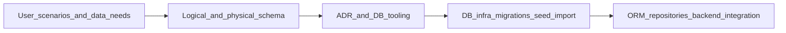

# Database Tasklist

## Обзор

Этот tasklist описывает следующий этап развития слоя данных: переход от текущего минимального PostgreSQL layer без управляемых миграций к полноценному data layer с актуализированной моделью данных, физической схемой, ADR по tooling, управляемыми миграциями, import/seed flow и интеграцией ORM/repository слоя в backend.

Этап должен довести проект до состояния, где PostgreSQL используется как основной и проверяемый persistence layer для backend, а локальная разработка и проверка БД опираются на документированные команды, миграции и предсказуемое начальное наполнение.

## Связь с plan.md

| Итерация [plan.md](../plan.md) | Как отражена в этом tasklist |
|--------------------------------|------------------------------|
| **1 — Backend foundation** | Учитывается как отправная точка: сейчас в backend уже есть минимальный PostgreSQL layer, `asyncpg` и runtime schema creation, но нет полноценного migration/data access workflow. |
| **3 — Web unified client** | Задача 01 фиксирует data requirements для будущего frontend и ролей `пользователь/инженер` и `админ`. |
| **5 — Platform readiness** | Задачи 03–05 подготавливают управляемый persistence layer, make-команды, seed/import и документацию как основу для дальнейшей platform readiness. |

## Легенда статусов

- 📋 Planned — запланирован
- 🚧 In Progress — в работе
- ✅ Done — завершён

## Список задач

| Задача | Описание | Статус | Документы |
|--------|----------|--------|-----------|
| 01 | Пользовательские сценарии и требования к данным для клиента/инженера и админа | ✅ Done | `docs/spec/user-scenarios.md`, `docs/vision.md`, `docs/data-model.md`, `backend/docs/api-contracts.md`, `docs/tasks/task-01-user-scenarios-and-data-needs/plan.md`, `docs/tasks/task-01-user-scenarios-and-data-needs/summary.md` |
| 02 | Логическая и физическая схема данных, physical ER и review gate | ✅ Done | `docs/data-model.md`, `docs/diagrams/database-er.md`, `docs/adr/adr-001-database.md`, `docs/tasks/task-02-logical-and-physical-schema/plan.md`, `docs/tasks/task-02-logical-and-physical-schema/summary.md` |
| 03 | ADR и выбор migration/data-access tooling | ✅ Done | `docs/adr/adr-003-database-migrations-and-access.md`, `docs/adr/README.md`, `README.md`, `docs/tasks/task-03-database-migrations-and-access/plan.md`, `docs/tasks/task-03-database-migrations-and-access/summary.md` |
| 04 | Инфраструктура БД, миграции, import/seed, локальные команды и проверка | ✅ Done | `Makefile`, `README.md`, `.env.example`, `backend/README.md`, `backend/.env.example`, `compose.yaml`, `alembic.ini`, `alembic/`, `data/progress-import.v1.json`, `docs/tasks/impl/database/plan.md`, `docs/tasks/impl/database/summary.md` |
| 05 | ORM-модели, репозитории и интеграция в backend вместо текущего minimal layer | ✅ Done | `backend/src/maintenance_backend/database.py`, `backend/src/maintenance_backend/models.py`, `backend/src/maintenance_backend/repositories.py`, `backend/tests_integration/conftest.py`, `backend/tests_integration/test_backend_persistence.py`, `README.md`, `backend/README.md`, `.env.example`, `backend/.env.example`, `docs/tasks/impl/database/plan.md`, `docs/tasks/impl/database/summary.md` |

## Прогресс этапа

- Итерационный plan: `docs/tasks/impl/database/plan.md`
- Итерационный summary: `docs/tasks/impl/database/summary.md`
- ✅ Задача 01 завершена: сохранены plan/summary, создан `docs/spec/user-scenarios.md`, синхронизированы `vision`, `data-model` и `api-contracts`.
- ✅ Задача 02 завершена: сохранены plan/summary, подготовлены logical + physical schema spec, отдельная ER-диаграмма и уточнение `ADR-001`.
- ✅ Задача 03 завершена: ADR, practical DB workflow и целевой migration/data-access stack зафиксированы и синхронизированы с реализацией.
- ✅ Задача 04 завершена: добавлены `compose.yaml`, Alembic baseline migration, import/seed tooling, sample dataset, `make`-команды и локальные backend DB docs; workflow проверен от `db-up` до `db-check`.
- ✅ Задача 05 завершена: backend переведён на SQLAlchemy async runtime layer, добавлены ORM-модели runtime subset, PostgreSQL integration tests и подтверждён persistence после restart backend.
- ✅ Database stage закрыт по фактическому implementation scope; follow-up задачи могут планироваться отдельно.

---

## Задача 01: Пользовательские сценарии и требования к данным ✅

### Цель

Зафиксировать базовые пользовательские сценарии и data requirements так, чтобы команда понимала, какие данные, сущности и связи должны поддерживать backend и будущий frontend для ролей `клиент/инженер` и `админ`.

### Состав работ

- [x] Описать несколько базовых сценариев без ухода в SQL/ORM: что должен видеть и выбирать `клиент/инженер`, что должен видеть и контролировать `админ`.
- [x] Зафиксировать обязательные представления данных: структура оборудования, текущее состояние, история изменений, фиксации состояния, авторы, источники данных, связи между объектами.
- [x] Вывести из сценариев минимально обязательный набор сущностей, полей и связей для backend API и будущего web-интерфейса.
- [x] Отдельно отметить данные, которые должны быть едиными для `backend`, `API` и будущего `web`, чтобы не дублировать модель в следующих итерациях.
- [x] Создать и согласовать ключевой артефакт сценариев: [docs/spec/user-scenarios.md](../spec/user-scenarios.md).
- [x] Актуализировать проектную документацию там, где уточняются роли, сценарии или data boundaries: [docs/vision.md](../vision.md), [docs/data-model.md](../data-model.md), [backend/docs/api-contracts.md](../../backend/docs/api-contracts.md), при необходимости [docs/plan.md](../plan.md).

### Артефакты

- `docs/tasks/tasklist-database.md` — согласованный tasklist этапа данных.
- `docs/spec/user-scenarios.md` — ключевой артефакт пользовательских сценариев и обязательных представлений данных.
- `docs/vision.md` — уточнённые пользовательские сценарии и акценты на ролях.
- `docs/data-model.md` — актуализированная доменная модель и набор обязательных данных.
- `backend/docs/api-contracts.md` — синхронизация терминов и обязательных полей, если сценарии уточняют контракты.
- `docs/tasks/task-01-user-scenarios-and-data-needs/plan.md` — сохранённый план выполнения задачи.
- `docs/tasks/task-01-user-scenarios-and-data-needs/summary.md` — итог и принятые решения по задаче.

### Документы

- Основной артефакт задачи — `docs/spec/user-scenarios.md`, а ход выполнения зафиксирован в `docs/tasks/task-01-user-scenarios-and-data-needs/plan.md` и `docs/tasks/task-01-user-scenarios-and-data-needs/summary.md`.

### Definition of Done — агент

- Сценарии для `клиент/инженер` и `админ` описаны достаточно, чтобы проектировать схему данных без догадок.
- Из сценариев получен явный список обязательных сущностей, полей и связей для backend и будущего frontend.
- `docs/spec/user-scenarios.md`, `vision.md`, `data-model.md` и `api-contracts.md` не противоречат друг другу по ролям и терминам.

### Definition of Done — пользователь

- Открыть `docs/spec/user-scenarios.md`, `docs/vision.md` и `docs/data-model.md`: должно быть понятно, какие данные видят инженер и админ.
- Открыть `backend/docs/api-contracts.md`: термины сценариев и основные поля не расходятся с моделью данных.
- Проверить глазами, что документ позволяет обсуждать frontend и data layer без обращения к коду.

### Проверка после задачи

- **Агент:** сверка ролей, сущностей и терминов между `docs/spec/user-scenarios.md`, `vision.md`, `data-model.md` и `api-contracts.md`.
- **Пользователь:** открыть обновлённые документы и вручную пройти сценарии `инженер` и `админ`.
- **Команды:** новые команды не обязательны; если появляются служебные команды проверки документов, зафиксировать их в `Makefile`.
- **Где результат:** `docs/spec/user-scenarios.md`, `docs/vision.md`, `docs/data-model.md`, `backend/docs/api-contracts.md`, при необходимости `docs/plan.md`.

---

## Задача 02: Логическая и физическая схема данных, ER и schema review ✅

### Цель

Перевести продуктовую модель в проектную схему PostgreSQL: актуализировать логическую модель, спроектировать физическую модель, вынести physical ER-диаграмму в отдельный артефакт и пройти обязательный review gate перед внедрением миграций.

### Состав работ

- [x] Уточнить логическую модель в [docs/data-model.md](../data-model.md) на основе сценариев задачи 01.
- [x] Спроектировать физическую модель PostgreSQL: таблицы, первичные и внешние ключи, ограничения, reference/lookup сущности, enum-значения и базовые индексы.
- [x] Добавить отдельный артефакт с physical ER-диаграммой; рекомендованный путь: `docs/diagrams/database-er.md`.
- [x] Зафиксировать, какие части схемы относятся к текущему этапу обязательно, а какие остаются follow-up после внедрения web и внешних источников.
- [x] Включить обязательный внешний review gate через `postgresql-table-design` перед внедрением миграций.
- [x] Добавить краткий внутренний чеклист ручной самопроверки схемы перед внешним review: корректность кардинальностей, обязательность FK, уникальности, idempotency-поля, audit timestamps, названия таблиц и колонок.
- [x] Проверить необходимость актуализации [docs/integrations.md](../integrations.md); в рамках текущей схемы новых data boundaries не появилось, отдельные правки не потребовались.

### Артефакты

- `docs/data-model.md` — логическая и физическая модель.
- `docs/diagrams/database-er.md` — отдельная physical ER-диаграмма.
- `docs/integrations.md` — обновления data boundaries и интеграционных зависимостей при необходимости.
- `docs/adr/adr-001-database.md` — архитектурная опора для выбранной стратегии хранения и эволюции схемы.
- `docs/tasks/task-02-logical-and-physical-schema/plan.md` — сохранённый план выполнения задачи.
- `docs/tasks/task-02-logical-and-physical-schema/summary.md` — итог и принятые решения по задаче.

### Документы

- Основные документы задачи: `docs/data-model.md`, `docs/diagrams/database-er.md`, `docs/adr/adr-001-database.md`, при необходимости `docs/integrations.md`.

### Definition of Done — агент

- В `data-model.md` есть актуальная логическая модель и достаточно конкретная физическая модель PostgreSQL.
- Physical ER вынесена в отдельный артефакт и соответствует текстовому описанию схемы.
- Для схемы зафиксирован обязательный внешний review gate через `postgresql-table-design`.
- Внутренний чеклист самопроверки схемы добавлен и покрывает ключевые риски проектирования.

### Definition of Done — пользователь

- Открыть `docs/data-model.md`: должно быть понятно, какие таблицы и связи планируются.
- Открыть `docs/diagrams/database-er.md`: связи и кардинальности должны читаться без обращения к коду.
- Проверить, что шаг внешнего schema review явно присутствует и не заменён только ручной проверкой.

### Проверка после задачи

- **Агент:** сверка логической модели, физической схемы и ER-диаграммы между собой; ручной проход по чеклисту самопроверки.
- **Пользователь:** открыть `data-model.md` и ER-диаграмму, убедиться, что схема читается и покрывает сценарии из задачи 01.
- **Команды:** при появлении генерации ER или служебных проверок добавить/актуализировать `make`-цели.
- **Где результат:** `docs/data-model.md`, `docs/diagrams/database-er.md`, при необходимости `docs/integrations.md`.

---

## Задача 03: ADR и выбор tooling для миграций и доступа к БД ✅

### Цель

Зафиксировать единый стек для миграций и доступа к PostgreSQL, описать его применение в проекте и прекратить использование runtime schema creation как основного механизма эволюции схемы.

### Состав работ

- [x] Сравнить текущий подход `asyncpg + hand-written schema on startup` с целевым migration/data-access stack.
- [x] Подготовить отдельный ADR по migration/data-access tooling и правилам его использования в проекте.
- [x] Зафиксировать рекомендуемый стек для реализации: `SQLAlchemy 2.x` + `Alembic`, async engine/session для PostgreSQL, repository layer поверх session layer.
- [x] Явно определить границы ответственности между ORM-моделями, миграциями, repository layer и backend services.
- [x] Подготовить короткую практическую справку: как создавать миграции, как применять миграции, как описывать модели, как не дублировать логику между ORM и репозиториями.
- [x] Обновить ADR-реестр в [docs/adr/README.md](../adr/README.md).
- [x] Синхронизировать [README.md](../../README.md) и [docs/data-model.md](../data-model.md) с новым решением на документарном уровне.
- [x] Зафиксировать итоговый migration/data-access workflow и его соответствие фактической реализации без дополнительных внешних блокеров.

### Артефакты

- `docs/adr/adr-003-database-migrations-and-access.md` — ADR по migration/data-access stack.
- `docs/adr/README.md` — обновлённый реестр ADR.
- `README.md` — краткая практическая справка по новому DB workflow, если её решено держать в основном developer entrypoint.
- `docs/tasks/task-03-database-migrations-and-access/plan.md` — сохранённый план выполнения задачи.
- `docs/tasks/task-03-database-migrations-and-access/summary.md` — итог и зафиксированные решения по migration/data-access workflow.

### Документы

- 📄 `docs/adr/adr-003-database-migrations-and-access.md`
- 📄 `docs/adr/README.md`
- 📄 `README.md`

### Definition of Done — агент

- Выбран и зафиксирован единый migration/data-access stack без двусмысленности.
- ADR объясняет, почему проект уходит от `ensure_schema()` на старте приложения как от основного механизма изменения схемы.
- Практическая справка описывает конкретный workflow миграций и моделей, пригодный для повседневной разработки.
- ADR и практический workflow синхронизированы с фактической реализацией в репозитории.

### Definition of Done — пользователь

- Открыть ADR: должно быть понятно, почему выбран именно этот стек.
- Открыть реестр ADR: новое решение внесено и не конфликтует с `ADR-001`.
- Открыть README или справочный раздел: по нему можно понять, как создавать и применять миграции в проекте.
- Открыть summary задачи: должно быть понятно, какой migration/data-access stack принят и как он отражён в коде и документации.

### Проверка после задачи

- **Агент:** сверить ADR с текущим кодом `backend/src/maintenance_backend/database.py` и `backend/src/maintenance_backend/repositories.py`, явно зафиксировать целевую замену текущего подхода.
- **Пользователь:** прочитать ADR и убедиться, что migration/data-access workflow понятен без чтения реализации.
- **Команды:** при появлении новых локальных команд миграций и DB tooling обязательно добавить их в `Makefile`.
- **Где результат:** `docs/adr/adr-003-database-migrations-and-access.md`, `docs/adr/README.md`, `README.md`, `docs/tasks/task-03-database-migrations-and-access/summary.md`.

---

## Задача 04: Инфраструктура БД, миграции, import/seed и локальные команды ✅

### Цель

Подготовить рабочую инфраструктуру локальной PostgreSQL-среды и управляемый DB workflow: запуск, пересоздание, миграции, seed/import, просмотр данных и ручную проверку наполнения на основе согласованного import-формата.

### Состав работ

- [x] Определить и задокументировать локальный dev-способ запуска PostgreSQL для проекта.
- [x] Добавить управляемые команды создания, пересоздания и очистки DB-окружения.
- [x] Добавить команды применения миграций, отката или сброса к clean state, просмотра текущей схемы и просмотра данных.
- [x] Перевести начальное наполнение на управляемый seed/import flow, не завязанный на ad-hoc schema/seed в startup приложения.
- [x] Так как `data/progress-import.v1.json` сейчас отсутствует в репозитории, сначала ввести шаблон или документированную спецификацию этого файла.
- [x] После фиксации формата подготовить importer под путь `data/progress-import.v1.json`.
- [x] Зафиксировать ручную проверку импортированных данных: что именно должно появиться в таблицах и какими командами это смотреть.
- [x] Актуализировать `README.md` и `.env.example` под новые локальные DB-команды и переменные окружения.
- [x] Ввести или актуализировать `make`-цели минимум для: запуска БД, пересоздания окружения, применения миграций, отката/сброса, seed/import, просмотра данных/быстрой выборки.

### Артефакты

- `Makefile` — новые и актуализированные DB-команды.
- `.env.example` — переменные для локальной БД и import/seed workflow.
- `README.md` — инструкция по запуску, пересозданию, миграциям, import/seed и просмотру данных.
- `backend/README.md` — backend-local справка по новому DB workflow.
- `backend/.env.example` — backend-only env-справка с актуальным `BACKEND_DATABASE_URL`.
- `data/progress-import.v1.json` — шаблон/спека, затем целевой файл импорта.
- DB-скрипты, migration scaffolding и import tooling в согласованной структуре репозитория.

### Документы

- 📄 `README.md`
- 📄 `.env.example`
- 📄 `Makefile`
- 📄 `backend/README.md`
- 📄 `backend/.env.example`

### Definition of Done — агент

- Локальная DB-среда запускается и пересоздаётся предсказуемыми командами.
- Миграции применяются и откатываются через зафиксированный workflow, а не через runtime `ensure_schema()`.
- Seed/import flow документирован и опирается на согласованный формат `data/progress-import.v1.json`.
- В `Makefile`, `README.md` и `.env.example` нет расхождений по командам и переменным.

### Definition of Done — пользователь

- Открыть `README.md`: должен быть понятный путь `поднять БД -> применить миграции -> импортировать данные -> посмотреть результат`.
- Запустить `make`-команды локальной БД и убедиться, что они соответствуют документации.
- Выполнить ручную проверку данных через команду просмотра или SQL-запрос и увидеть импортированный результат.

### Проверка после задачи

- **Агент:** прогнать локальный DB workflow от clean state до импортированных данных и сверить его с README.
- **Пользователь:** выполнить команды запуска, миграции и import/seed из README; проверить данные глазами или SQL-запросом.
- **Команды:** обязательно поддерживать и документировать `make`-команды для DB lifecycle, migrations, import/seed и data inspection.
- **Где результат:** `Makefile`, `README.md`, `.env.example`, `backend/README.md`, `backend/.env.example`, DB tooling, `data/progress-import.v1.json`.

---

## Задача 05: ORM-модели, репозитории и интеграция слоя данных в backend ✅

### Цель

Заменить текущий minimal persistence layer на полноценный ORM/repository-based data layer и встроить его в backend так, чтобы сценарий записи и чтения данных из PostgreSQL проходил через новый управляемый слой.

### Состав работ

- [x] Спланировать и реализовать перенос с текущих `backend/src/maintenance_backend/database.py` и `backend/src/maintenance_backend/repositories.py` на новый data layer.
- [x] Ввести ORM-модели для актуального набора таблиц текущего этапа.
- [x] Ввести repository layer поверх выбранного session/engine подхода и зафиксировать его границы относительно domain services.
- [x] Встроить новый data layer в lifecycle backend и dependency wiring.
- [x] Убрать зависимость от runtime schema creation как основного механизма изменения схемы.
- [x] Перевести backend на работу через новый persistent layer для как минимум текущих сценариев `equipment` и `equipment-state-records`.
- [x] Актуализировать backend-тесты под реальную БД или под согласованный integration test flow с миграциями.
- [x] Добавить проверку сценария `POST /api/v1/equipment-state-records` на новом persistent layer.
- [x] Проверить `GET /health` и `GET /ready` после перехода и синхронизировать operational поведение с документацией.
- [x] Актуализировать [backend/docs/api-contracts.md](../../backend/docs/api-contracts.md), [README.md](../../README.md), [`.env.example`](../../.env.example), при необходимости [docs/integrations.md](../integrations.md).

### Артефакты

- Новый data layer в `backend/` с ORM-моделями, session/engine wiring и репозиториями.
- Обновлённые backend tests под новый persistence flow, включая `backend/tests_integration/`.
- Актуализированные `backend/docs/api-contracts.md`, `README.md`, `.env.example`, `backend/README.md`, `backend/.env.example`.

### Документы

- 📄 `backend/docs/api-contracts.md`
- 📄 `README.md`
- 📄 `.env.example`

### Definition of Done — агент

- Backend больше не опирается на runtime schema creation как основной механизм эволюции схемы.
- ORM-модели, репозитории и dependency wiring работают согласованно и поддерживают текущие backend-сценарии.
- Тесты покрывают переход на новый persistent layer и подтверждают рабочий сценарий `POST /api/v1/equipment-state-records`.
- `health/ready` и developer docs синхронизированы с фактическим поведением backend.
- `alembic` metadata согласована с baseline migration и не даёт лишних schema diff при autogenerate/check.

### Definition of Done — пользователь

- Поднять backend на локальной БД, выполнить сценарий записи состояния и получить корректный ответ.
- Открыть `backend/docs/api-contracts.md` и `README.md`: документация должна соответствовать фактическому поведению backend.
- Запустить backend-тесты и убедиться, что проверка persistence flow входит в их набор.
- Перезапустить backend и убедиться, что созданная запись остаётся в PostgreSQL.

### Проверка после задачи

- **Агент:** полный прогон backend quality и integration flow на PostgreSQL, ручная проверка `POST /api/v1/equipment-state-records`, сверка readiness/liveness и документации.
- **Пользователь:** поднять backend, выполнить сценарий записи состояния, затем проверить данные и operational endpoints вручную.
- **Команды:** новые команды backend/data layer и integration checks должны быть добавлены или актуализированы в `Makefile`.
- **Где результат:** код backend data layer, backend tests, `backend/docs/api-contracts.md`, `README.md`, `.env.example`, `backend/README.md`, `backend/.env.example`.

---

## Итог этапа данных

| | |
|--|--|
| **Агент** | Есть согласованные сценарии и data requirements, физическая схема, ADR по tooling, управляемый DB workflow, ORM/repository слой и backend integration без опоры на ad-hoc schema creation. |
| **Пользователь** | Можно открыть документы, поднять локальную БД, применить миграции, импортировать данные, проверить состояние backend и пройти базовый persistence flow вручную. |
| **Команды** | Все новые локальные команды запуска, проверки и обслуживания БД должны быть зафиксированы через `make` и отражены в `README.md`. |
| **Результат** | Проект получает полноценную основу для PostgreSQL-backed data layer, дальнейшего web-клиента и развития интеграций без возврата к in-memory/ad-hoc persistence подходу. |
