# DevOps Tasklist

## Обзор

Этот tasklist описывает подготовительный DevOps-этап проекта: переход от локального host-run onboarding к единому контейнерному стеку и базовому pipeline публикации образов. Полноценный CI/CD, deployment automation и production-hardening в этот этап не входят.

Текущая отправная точка репозитория:
- в корне уже есть `compose.yaml` с full-stack описанием `postgres`, `backend`, `frontend` и optional `bot`;
- в `Makefile` уже есть `stack-*` команды и сохранены host-run / DB-only цели;
- Dockerfile сервисов уже находятся в `devops/backend/`, `devops/frontend/`, `devops/bot/`;
- `.github/workflows/` пока отсутствует;
- основное отставание находится в верификации container contract, cleanup UX и docs sync.

```mermaid
flowchart LR
  artifacts[Devops_artifacts_structure]
  dockerfiles[Dockerfiles_and_dockerignore]
  compose[Unified_root_compose]
  make[Makefile_stack_commands]
  docs[Compose_docs_and_project_sync]
  review[Docker_review_gate]
  ghcr[GHCR_build_publish_workflow]
  registry[Compose_on_registry_images]
  docs2[Registry_and_GHA_docs]
  artifacts --> dockerfiles --> compose --> make --> docs --> review --> ghcr --> registry --> docs2
```

## Связь с plan.md

| Итерация [plan.md](../plan.md) | Как отражена в этом tasklist |
|--------------------------------|------------------------------|
| **5 — Platform readiness** | Подготовительный DevOps-слой для локального полного стека, базовых контейнерных артефактов и image pipeline без полного CI/CD. |
| **Следующие итерации platform/devops** | Полноценные CI-проверки, deployment automation, окружения beyond local и эксплуатационные политики остаются вне этого tasklist и выносятся в отдельный этап. |

## Skills и review gates

- Для задач по Docker-конфигурации обязателен review через skill `docker-expert`.
- Для workflow публикации образов обязателен skill `github-actions-templates`.
- Использование этих skills должно быть отражено в plan/summary соответствующих задач, а не оставлено как неформальная рекомендация.

## Легенда статусов

- 📋 Planned — запланирован
- 🚧 In Progress — в работе
- ✅ Done — завершён

## Список задач

| Задача | Описание | Статус | Документы |
|--------|----------|--------|-----------|
| 01 | Архитектура devops-артефактов и целевая структура `devops/` | ✅ Done | [plan](impl/devops/iteration-1-local-stack/tasks/task-01-devops-artifacts-structure/plan.md) \| [summary](impl/devops/iteration-1-local-stack/tasks/task-01-devops-artifacts-structure/summary.md) |
| 02 | Dockerfile и `.dockerignore` для backend, frontend и bot | ✅ Done | [plan](impl/devops/iteration-1-local-stack/tasks/task-02-runtime-images/plan.md) \| [summary](impl/devops/iteration-1-local-stack/tasks/task-02-runtime-images/summary.md) |
| 03 | Единый корневой `compose.yaml` для полного стека | ✅ Done | [plan](impl/devops/iteration-1-local-stack/tasks/task-03-root-compose/plan.md) \| [summary](impl/devops/iteration-1-local-stack/tasks/task-03-root-compose/summary.md) |
| 04 | Makefile-команды для полного контейнерного стека | ✅ Done | [plan](impl/devops/iteration-1-local-stack/tasks/task-04-makefile-stack-commands/plan.md) \| [summary](impl/devops/iteration-1-local-stack/tasks/task-04-makefile-stack-commands/summary.md) |
| 05 | Отдельная инструкция по локальному запуску через Docker Compose | ✅ Done | [plan](impl/devops/iteration-1-local-stack/tasks/task-05-compose-local-runbook/plan.md) \| [summary](impl/devops/iteration-1-local-stack/tasks/task-05-compose-local-runbook/summary.md) |
| 06 | Обновление проектной документации под новый compose entrypoint | ✅ Done | [plan](impl/devops/iteration-1-local-stack/tasks/task-06-docs-sync/plan.md) \| [summary](impl/devops/iteration-1-local-stack/tasks/task-06-docs-sync/summary.md) |
| 07 | Review итоговой Docker-конфигурации через `docker-expert` | ✅ Done | [plan](impl/devops/iteration-1-local-stack/tasks/task-07-docker-review/plan.md) \| [summary](impl/devops/iteration-1-local-stack/tasks/task-07-docker-review/summary.md) |
| 08 | GitHub Actions workflow сборки и публикации образов в GHCR | 📋 Planned | [plan](impl/devops/iteration-2-image-pipeline/tasks/task-08-ghcr-workflow/plan.md) \| [summary](impl/devops/iteration-2-image-pipeline/tasks/task-08-ghcr-workflow/summary.md) |
| 09 | Адаптация compose для запуска на образах из registry | 📋 Planned | [plan](impl/devops/iteration-2-image-pipeline/tasks/task-09-compose-registry-images/plan.md) \| [summary](impl/devops/iteration-2-image-pipeline/tasks/task-09-compose-registry-images/summary.md) |
| 10 | Документация по GHCR, тегам образов и локальному запуску с registry | 📋 Planned | [plan](impl/devops/iteration-2-image-pipeline/tasks/task-10-registry-docs/plan.md) \| [summary](impl/devops/iteration-2-image-pipeline/tasks/task-10-registry-docs/summary.md) |

## Итерация 1: Local Docker Compose Stack ✅

### Цель

Подготовить единый контейнерный способ локального запуска всего проекта: `postgres`, `backend`, `frontend` и optional `bot`, с единым root compose entrypoint, удобными make-командами и синхронизированной документацией.

### Acceptance Snapshot

- `self-check`: compose поднимает full stack; health-check и логи читаются; `Makefile` покрывает build, запуск, диагностику и cleanup.
- `user-check`: человек поднимает стек через `make stack-up`, открывает frontend, проверяет backend health и понимает, как остановить стек и очистить state.

---

## Задача 01: Архитектура devops-артефактов и целевая структура `devops/` ✅

### Цель

Зафиксировать, где в проекте живут Docker- и сопутствующие DevOps-артефакты, чтобы последующие задачи не разносили Dockerfile, env-шаблоны и compose-вспомогательные файлы хаотично по корню репозитория.

### Состав работ

- [x] Спроектировать базовую директорию `devops/` как единое место для DevOps-артефактов проекта.
- [x] Предложить вложенность по сервисам и общим ресурсам: `devops/backend/`, `devops/frontend/`, `devops/bot/`, `devops/compose/` как однозначную целевую структуру.
- [x] Зафиксировать, какие файлы остаются в корне как operational entrypoint, а какие переносятся под `devops/`.
- [x] Явно обосновать, почему Dockerfile и вспомогательные артефакты не должны расползаться по корню репозитория.
- [x] Актуализировать ссылки на новую структуру в документации задачи и итерации.

### Артефакты

- `devops/` — базовая директория DevOps-артефактов.
- `devops/README.md`
- `devops/compose/README.md`
- `docs/tasks/impl/devops/iteration-1-local-stack/plan.md`
- `docs/tasks/impl/devops/iteration-1-local-stack/summary.md`
- `docs/tasks/impl/devops/iteration-1-local-stack/tasks/task-01-devops-artifacts-structure/plan.md`
- `docs/tasks/impl/devops/iteration-1-local-stack/tasks/task-01-devops-artifacts-structure/summary.md`

### Документы

- 📋 [План](impl/devops/iteration-1-local-stack/tasks/task-01-devops-artifacts-structure/plan.md)
- 📝 [Summary](impl/devops/iteration-1-local-stack/tasks/task-01-devops-artifacts-structure/summary.md)

### Definition of Done — агент

- Целевая структура `devops/` однозначна и покрывает backend, frontend, bot и общие compose-артефакты.
- Решение объясняет, какие файлы остаются в корне и почему.
- Соглашение отражает принципы `docker-expert`: root entrypoint остаётся минимальным, service Dockerfiles сгруппированы по сервисам, shared Compose-artifacts получают отдельное место.

### Definition of Done — пользователь

- По описанию задачи понятно, где искать Dockerfile, compose-связанные файлы и будущие DevOps-инструкции.

---

## Задача 02: Dockerfile и `.dockerignore` для backend, frontend и bot ✅

### Цель

Подготовить контейнерные артефакты для всех runtime-сервисов проекта так, чтобы полный локальный стек можно было собирать и запускать через Docker Compose.

### Состав работ

- [x] Провести ревизию существующих Dockerfile для `backend`, `frontend` и `bot` в согласованной структуре `devops/`.
- [x] Уточнить root `.dockerignore` для сокращения build context и исключения лишних файлов.
- [x] Для каждого сервиса зафиксировать dev/local-oriented образ без смешивания полного production-hardening в эту итерацию.
- [x] Отдельно описать runtime entrypoint, порты, env-зависимости и ожидания по image-only режиму.
- [x] Провести review Dockerfile и build-подхода через skill `docker-expert`.

### Артефакты

- Dockerfile и `.dockerignore` для `backend`, `frontend`, `bot`.
- `docs/tasks/impl/devops/iteration-1-local-stack/tasks/task-02-runtime-images/plan.md`
- `docs/tasks/impl/devops/iteration-1-local-stack/tasks/task-02-runtime-images/summary.md`

### Документы

- 📋 [План](impl/devops/iteration-1-local-stack/tasks/task-02-runtime-images/plan.md)
- 📝 [Summary](impl/devops/iteration-1-local-stack/tasks/task-02-runtime-images/summary.md)

### Definition of Done — агент

- Все три runtime-сервиса имеют собираемые контейнерные образы и адекватный `.dockerignore`.
- Review через `docker-expert` выполнен и отражён в summary.

### Definition of Done — пользователь

- По структуре репозитория и summary понятно, где лежат Dockerfile каждого сервиса и зачем нужен каждый образ.

---

## Задача 03: Единый корневой `compose.yaml` для полного стека ✅

### Цель

Собрать весь локальный стек в одном root compose entrypoint и отказаться от DB-only схемы как основной точки входа, если нет явной причины оставлять её отдельно.

### Состав работ

- [x] Зафиксировать текущий `compose.yaml` как корневой compose-файл полного стека.
- [x] Подтвердить default stack для `postgres`, `backend`, `frontend` и optional profile для `bot`.
- [x] Зафиксировать зависимости старта и health/readiness там, где они действительно нужны.
- [x] Переопределить устаревшее описание DB-only `compose.yaml` в tasklist и summary.
- [x] Проверить сценарий запуска полного стека из локальной сборки.

### Артефакты

- Корневой `compose.yaml` как единый compose entrypoint.
- `docs/tasks/impl/devops/iteration-1-local-stack/tasks/task-03-root-compose/plan.md`
- `docs/tasks/impl/devops/iteration-1-local-stack/tasks/task-03-root-compose/summary.md`

### Документы

- 📋 [План](impl/devops/iteration-1-local-stack/tasks/task-03-root-compose/plan.md)
- 📝 [Summary](impl/devops/iteration-1-local-stack/tasks/task-03-root-compose/summary.md)

### Definition of Done — агент

- Один корневой compose entrypoint поднимает весь стек и не оставляет двусмысленности между старым и новым способом запуска.
- Зафиксированы обязательные smoke/health-проверки после старта.

### Definition of Done — пользователь

- Есть один понятный compose entrypoint для локального старта полного проекта.

---

## Задача 04: Makefile-команды для полного контейнерного стека ✅

### Цель

Сделать корневой `Makefile` удобной точкой входа для запуска, остановки и диагностики полного контейнерного стека.

### Состав работ

- [x] Зафиксировать команды для подъёма и остановки полного стека.
- [x] Зафиксировать команду статуса compose-сервисов.
- [x] Зафиксировать команды логов: всего стека и отдельного сервиса.
- [x] Оставить быстрый smoke/health-check для проверки backend после старта.
- [x] Развести существующие DB-only цели и новый full-stack workflow по разным сценариям.

### Артефакты

- `Makefile` — обновлённые full-stack команды.
- `docs/tasks/impl/devops/iteration-1-local-stack/tasks/task-04-makefile-stack-commands/plan.md`
- `docs/tasks/impl/devops/iteration-1-local-stack/tasks/task-04-makefile-stack-commands/summary.md`

### Документы

- 📋 [План](impl/devops/iteration-1-local-stack/tasks/task-04-makefile-stack-commands/plan.md)
- 📝 [Summary](impl/devops/iteration-1-local-stack/tasks/task-04-makefile-stack-commands/summary.md)

### Definition of Done — агент

- `Makefile` покрывает запуск, остановку, статус, логи всего стека, логи по сервису и базовый smoke-check.
- Команды не создают второй параллельный lifecycle поверх compose без явной необходимости.

### Definition of Done — пользователь

- По `make`-командам можно запустить, остановить и диагностировать весь стек без ручного ввода длинных `docker compose` команд.

---

## Задача 05: Отдельная инструкция по локальному запуску через Docker Compose ✅

### Цель

Подготовить отдельный runbook для локального запуска всего проекта через Docker Compose как новый операционный сценарий разработки.

### Состав работ

- [x] Создать отдельную инструкцию по docker compose для локального запуска всего проекта.
- [x] Описать подготовку env, сборку и запуск полного стека.
- [x] Описать обязательные проверки после старта: frontend, backend health, логи.
- [x] Добавить сценарии остановки, очистки и повторного запуска.
- [x] Добавить типовые проблемы и способы диагностики.

### Артефакты

- Новый документ с runbook локального запуска через Docker Compose.
- `docs/tasks/impl/devops/iteration-1-local-stack/tasks/task-05-compose-local-runbook/plan.md`
- `docs/tasks/impl/devops/iteration-1-local-stack/tasks/task-05-compose-local-runbook/summary.md`

### Документы

- 📋 [План](impl/devops/iteration-1-local-stack/tasks/task-05-compose-local-runbook/plan.md)
- 📝 [Summary](impl/devops/iteration-1-local-stack/tasks/task-05-compose-local-runbook/summary.md)

### Definition of Done — агент

- Runbook покрывает подготовку env, запуск, проверку, логи, остановку и типовые проблемы.

### Definition of Done — пользователь

- По инструкции можно поднять и проверить полный контейнерный стек без чтения исходников.

---

## Задача 06: Обновление проектной документации под новый compose entrypoint ✅

### Цель

Синхронизировать project docs с новым контейнерным способом запуска и убрать противоречия между старым host-run сценарием и новым full-stack compose сценарием.

### Состав работ

- [x] Обновить `README.md` под новый compose entrypoint.
- [x] Обновить `docs/onboarding.md` с учётом контейнерного локального цикла.
- [x] Обновить `backend/README.md` и проверить `frontend/README.md` на отсутствие противоречий.
- [x] Явно описать, какие сценарии остаются host-run, а какой сценарий становится основным для локального полного стека.
- [x] Синхронизировать новые пути к DevOps-артефактам и make-командам.

### Артефакты

- Обновлённые `README.md`, `docs/onboarding.md` и при необходимости component README.
- `docs/tasks/impl/devops/iteration-1-local-stack/tasks/task-06-docs-sync/plan.md`
- `docs/tasks/impl/devops/iteration-1-local-stack/tasks/task-06-docs-sync/summary.md`

### Документы

- 📋 [План](impl/devops/iteration-1-local-stack/tasks/task-06-docs-sync/plan.md)
- 📝 [Summary](impl/devops/iteration-1-local-stack/tasks/task-06-docs-sync/summary.md)

### Definition of Done — агент

- В документации нет противоречий между старым и новым способом локального запуска.
- Новый compose workflow и make-команды отражены во всех основных entrypoint-документах.

### Definition of Done — пользователь

- После чтения `README.md` и onboarding понятно, как именно теперь запускать полный стек локально.

---

## Задача 07: Review итоговой Docker-конфигурации через `docker-expert` ✅

### Цель

Провести отдельный review-gate итоговой Docker-конфигурации перед закрытием итерации локального стека.

### Состав работ

- [x] Прогнать итоговые Dockerfile, `.dockerignore` и compose-конфигурацию через skill `docker-expert`.
- [x] Зафиксировать риски и необходимые правки по build speed, layering, volumes, security и local DX.
- [x] Внести обязательные исправления по результатам review.
- [x] Зафиксировать итог review как часть критериев завершения итерации, а не как факультативную заметку.

### Артефакты

- Review notes и итоговый summary по Docker-конфигурации.
- `docs/tasks/impl/devops/iteration-1-local-stack/tasks/task-07-docker-review/plan.md`
- `docs/tasks/impl/devops/iteration-1-local-stack/tasks/task-07-docker-review/summary.md`

### Документы

- 📋 [План](impl/devops/iteration-1-local-stack/tasks/task-07-docker-review/plan.md)
- 📝 [Summary](impl/devops/iteration-1-local-stack/tasks/task-07-docker-review/summary.md)

### Definition of Done — агент

- Review через `docker-expert` выполнен после сборки полного локального стека.
- Все существенные замечания либо исправлены, либо явно зафиксированы как follow-up.

### Definition of Done — пользователь

- В summary видно, что Docker-конфигурация не просто создана, а отдельно проверена и доработана по review.

---

## Итерация 2: Image Pipeline via GitHub Actions 📋

### Цель

Добавить минимальный pipeline сборки и публикации контейнерных образов в GHCR и проверить, что локальный compose-сценарий умеет работать не только с локальной сборкой, но и с registry-образами.

### Acceptance Snapshot

- `self-check`: workflow валиден, собирает и публикует образы в GHCR по заданным trigger'ам; compose запускает стек на registry-образах.
- `user-check`: человек находит workflow, понимает схему тегов и запускает локальный compose-сценарий на опубликованных образах.

---

## Задача 08: GitHub Actions workflow сборки и публикации образов в GHCR 📋

### Цель

Подготовить отдельный workflow для сборки и публикации образов проекта в GitHub Container Registry без разрастания в полный CI/CD pipeline.

### Состав работ

- [ ] Использовать skill `github-actions-templates` для проектирования workflow.
- [ ] Создать workflow в `.github/workflows/` только для build/publish образов.
- [ ] Описать trigger'ы, permissions, registry auth и tagging strategy.
- [ ] Зафиксировать, какие образы публикуются и как они именуются в `ghcr.io`.
- [ ] Не смешивать этот workflow с тестами, линтами и deployment automation, если это не требуется для публикации образов.

### Артефакты

- `.github/workflows/` — workflow сборки и публикации образов.
- `docs/tasks/impl/devops/iteration-2-image-pipeline/tasks/task-08-ghcr-workflow/plan.md`
- `docs/tasks/impl/devops/iteration-2-image-pipeline/tasks/task-08-ghcr-workflow/summary.md`

### Документы

- 📋 [План](impl/devops/iteration-2-image-pipeline/tasks/task-08-ghcr-workflow/plan.md)
- 📝 [Summary](impl/devops/iteration-2-image-pipeline/tasks/task-08-ghcr-workflow/summary.md)

### Definition of Done — агент

- Workflow использует актуальный подход для GHCR и спроектирован с помощью `github-actions-templates`.
- Публикация образов не запускается на небезопасных или нецелевых событиях.

### Definition of Done — пользователь

- По workflow и summary понятно, когда собираются образы, куда публикуются и как маркируются тегами.

---

## Задача 09: Адаптация compose для запуска на образах из registry 📋

### Цель

Проверить и зафиксировать, что compose-конфигурация поддерживает запуск полного стека на образах из registry, а не только на локальной сборке.

### Состав работ

- [ ] Провести review compose-сценария для запуска на облачных образах.
- [ ] Адаптировать текущий root compose entrypoint или его параметры так, чтобы не плодить второй основной compose-файл без явной необходимости.
- [ ] Проверить сценарий запуска полного стека на образах из GHCR.
- [ ] Зафиксировать различия между local-build и registry-image режимами запуска.

### Артефакты

- Обновлённый compose entrypoint или его конфигурационные расширения для registry-образов.
- `docs/tasks/impl/devops/iteration-2-image-pipeline/tasks/task-09-compose-registry-images/plan.md`
- `docs/tasks/impl/devops/iteration-2-image-pipeline/tasks/task-09-compose-registry-images/summary.md`

### Документы

- 📋 [План](impl/devops/iteration-2-image-pipeline/tasks/task-09-compose-registry-images/plan.md)
- 📝 [Summary](impl/devops/iteration-2-image-pipeline/tasks/task-09-compose-registry-images/summary.md)

### Definition of Done — агент

- Compose умеет запускать полный стек на registry-образах без появления второго конкурирующего main entrypoint.
- Сценарий запуска на GHCR-образах проверен и описан.

### Definition of Done — пользователь

- Понятно, как переключиться с локальной сборки на запуск из опубликованных образов.

---

## Задача 10: Документация по GHCR, тегам образов и локальному запуску с registry 📋

### Цель

Описать новый image pipeline и локальный режим работы с registry-образами так, чтобы команда могла использовать его без чтения workflow YAML.

### Состав работ

- [ ] Задокументировать, где лежит workflow публикации образов.
- [ ] Описать требуемые secrets и permissions для GHCR.
- [ ] Описать схему тегов образов и правила чтения этих тегов человеком.
- [ ] Добавить инструкцию по локальному запуску полного стека на образах из registry.
- [ ] Синхронизировать README/onboarding и DevOps-документацию с новым pipeline.

### Артефакты

- Обновлённая документация по GHCR и локальному запуску на registry-образах.
- `docs/tasks/impl/devops/iteration-2-image-pipeline/tasks/task-10-registry-docs/plan.md`
- `docs/tasks/impl/devops/iteration-2-image-pipeline/tasks/task-10-registry-docs/summary.md`

### Документы

- 📋 [План](impl/devops/iteration-2-image-pipeline/tasks/task-10-registry-docs/plan.md)
- 📝 [Summary](impl/devops/iteration-2-image-pipeline/tasks/task-10-registry-docs/summary.md)

### Definition of Done — агент

- Документация объясняет workflow, теги образов, permissions и локальный запуск на registry-образах.
- Документы синхронизированы с фактическим workflow и compose-конфигурацией.

### Definition of Done — пользователь

- Без чтения YAML-файлов понятно, как найти workflow, как устроены теги образов и как запустить стек из GHCR.

---

## Обязательные сценарии проверки

Эти сценарии должны быть явно закрыты в plan/summary соответствующих задач:

- запуск полного стека из локальной сборки;
- остановка и очистка;
- просмотр логов всего стека;
- просмотр логов одного сервиса;
- smoke/health-проверка backend после старта;
- запуск полного стека из GHCR-образов.

## Границы этапа

- Этот tasklist не включает полный CI для тестов и линтеров.
- Этот tasklist не включает deployment automation и развёртывание в удалённые окружения.
- Этот tasklist не включает полный production-hardening beyond minimum viable containerization для локального и preparatory image workflow.
