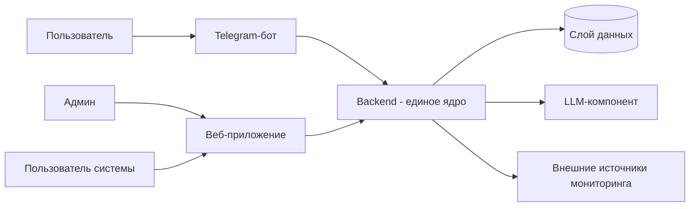
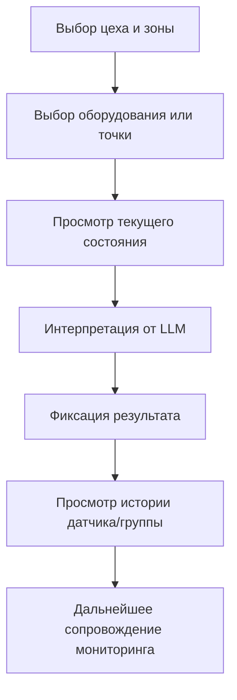

# Видение системы мониторинга оборудования

Документ развивает [idea.md](idea.md) и фиксирует целевую картину продукта на уровне vision.

---

## Продуктовые границы

- Продукт — это система мониторинга состояния оборудования, а не только Telegram-бот.
- Telegram-бот — первый клиент системы для быстрого старта и повседневных запросов.
- В продукт входит единое веб-приложение с двумя ролями: админ и пользователь.
- Ценность системы: видеть общее состояние, фиксировать отклонения от нормы и сопровождать мониторинг в динамике.

---

## Архитектурный принцип

- Бот не является ядром системы.
- Единое ядро — backend, где централизована бизнес-логика.
- Telegram-бот и веб-приложение выступают клиентами одного backend.
- Анализ состояния оборудования, работа с источниками данных, фиксация результатов и интерпретация от LLM происходят в backend.

---

## High-level архитектура



### Роли компонентов

- **Telegram-бот (клиент):** быстрые запросы и короткие ответы по состоянию оборудования.
- **Веб-приложение (клиент):** единый интерфейс для админа и пользователя, обзор и сопровождение мониторинга.
- **Backend (ядро):** единая логика состояния, правил анализа, фиксации результатов и интерпретации.
- **Слой данных:** хранение состояния, истории и результатов мониторинга.
- **LLM-компонент:** понятная интерпретация текущего состояния и отклонений для человека.

---

## Роли и пользовательские сценарии

Детальные пользовательские сценарии и обязательные представления данных вынесены в `docs/spec/user-scenarios.md`.

### Роли

- **Клиент/инженер:** единая операционная роль для повседневной работы с оборудованием в своей зоне ответственности. Эта роль просматривает текущее состояние, историю и вручную фиксирует наблюдения.
- **Админ:** ведёт структуру мониторинга, контролирует общую картину, качество сопровождения и review ручных фиксаций.

### Базовые пользовательские потоки

#### 1. Навигация по структуре мониторинга

- `Клиент/инженер` или `админ` выбирает площадку, цех, участок и нужную единицу оборудования.
- Система должна показывать понятную структуру объекта мониторинга: иерархию локаций, список оборудования, связанные точки мониторинга, датчики и группы датчиков.
- Обязательные данные для этого потока: структура объекта мониторинга, привязка оборудования к локации, ответственный за оборудование, краткий текущий статус.

#### 2. Просмотр текущего состояния оборудования

- `Клиент/инженер` открывает карточку оборудования и получает актуальное состояние на сейчас.
- Система должна показывать агрегированный статус оборудования, краткую интерпретацию, связанные датчики или группы датчиков и источник текущей оценки.
- Обязательные данные для этого потока: текущее состояние, источник данных, связанные датчики/группы, время актуальности состояния, ответственный за объект.

#### 3. Просмотр истории изменений и последних фиксаций

- `Клиент/инженер` или `админ` просматривает, как менялось состояние оборудования и какие ручные записи уже были сделаны.
- Система должна различать текущее состояние и историю наблюдений: внешние или вычисленные snapshots состояния отдельно от ручных фиксаций.
- Обязательные данные для этого потока: история состояний, история фиксаций, авторы записей, источники данных, статус разбора каждой записи.

#### 4. Ручная фиксация наблюдения

- `Клиент/инженер` фиксирует результат наблюдения по оборудованию: статус, комментарий, время наблюдения и контекст канала.
- Эта фиксация становится частью общей истории состояния и не считается единственным источником истины о текущем состоянии.
- Обязательные данные для этого потока: запись фиксации состояния, автор, канал, время наблюдения, комментарий, связь с оборудованием, источник записи как `manual`.

#### 5. Административный контроль общей картины

- `Админ` просматривает состояние по площадкам, цехам и участкам, видит зоны риска и качество сопровождения по объектам.
- Система должна позволять быстро выявить проблемные единицы оборудования, записи без review и объекты без понятного ответственного.
- Обязательные данные для этого потока: агрегированное текущее состояние по структуре, ответственный за оборудование, последние фиксации, статус разбора записей, источники данных.

#### 6. Review и закрытие ручной фиксации

- `Админ` проверяет ручную фиксацию, подтверждает её, оставляет комментарий или закрывает запись как разобранную.
- Review не отменяет историю, а дополняет запись управленческим статусом сопровождения.
- Обязательные данные для этого потока: запись фиксации, автор, reviewer, время review, статус разбора записи, связь с оборудованием и текущим состоянием.



---

## Доменные сущности (уровень vision)

Детализация структуры и связей переносится в `docs/data-model.md`.

- Клиент/инженер
- Админ
- Локация / иерархия размещения
- Единица оборудования
- Датчик
- Группа датчиков
- Текущее состояние оборудования
- Результат фиксации состояния
- Источник данных
- FAQ / knowledge item

### Обязательные представления данных для backend и будущего web

- Структура объекта мониторинга: площадка, цех, участок, оборудование, связанные датчики и группы датчиков.
- Текущее состояние оборудования: агрегированный статус, момент актуальности, краткая интерпретация, источник состояния.
- История: snapshots состояния и ручные фиксации как отдельные, но связанные представления.
- Авторство и происхождение данных: кто создал запись, из какого канала она пришла, из какого источника получено состояние.
- Ответственность и сопровождение: кто отвечает за оборудование, кто проверил запись, в каком статусе находится её разбор.
- Подробная декомпозиция этих представлений по сценариям зафиксирована в `docs/spec/user-scenarios.md`.

---

## Внешние связи (уровень vision)

Детализация контрактов и форматов переносится в `docs/integrations.md`.

- Источники данных мониторинга оборудования
- Внешний LLM-сервис для интерпретации состояния
- Клиентские каналы взаимодействия (Telegram и Web)

---

## Архитектурные решения

Ключевые решения фиксируются в ADR-реестре: `docs/adr/README.md`.

Первое зафиксированное решение:
- **ADR-001:** выбор **PostgreSQL** как основной СУБД для MVP и дальнейшего развития системы (`docs/adr/adr-001-database.md`).

Дополнительно для backend bootstrap:
- **ADR-002:** backend-стек MVP, backend-first границы и thin-clients подход для `bot` и будущего `web` (`docs/adr/adr-002-backend-stack.md`).

---

## Целевая структура проекта (логический уровень)

```text
tg-maintenance-bot/
├── bot/       # Telegram-клиент
├── backend/   # единое ядро системы
├── web/       # единый frontend-проект (админ/пользователь)
└── docs/      # продуктовые и архитектурные документы
```

---

## Рамки документа

- Документ фиксирует видение и границы системы.
- Низкоуровневая реализация, API-эндпоинты и схема БД описываются в отдельных документах.
