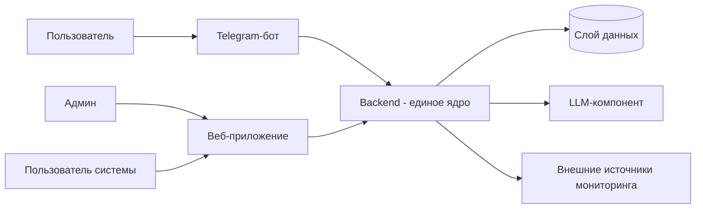
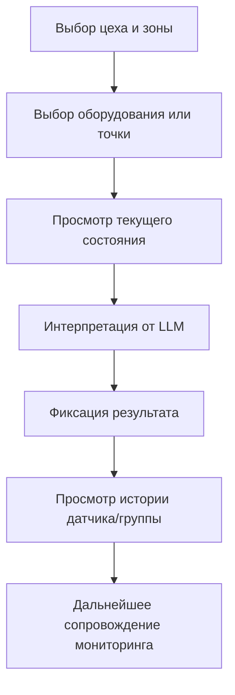

# Видение системы мониторинга оборудования

Документ развивает [idea.md](idea.md) и фиксирует целевую картину продукта на уровне vision.

---

## Продуктовые границы

- Продукт — это система мониторинга состояния оборудования, а не только Telegram-бот.
- Telegram-бот — первый клиент системы для быстрого старта и повседневных запросов.
- В продукт входит единое веб-приложение с двумя ролями: админ и пользователь.
- Ценность системы: видеть общее состояние, фиксировать отклонения от нормы и сопровождать мониторинг в динамике.

---

## Архитектурный принцип

- Бот не является ядром системы.
- Единое ядро — backend, где централизована бизнес-логика.
- Telegram-бот и веб-приложение выступают клиентами одного backend.
- Анализ состояния оборудования, работа с источниками данных, фиксация результатов и интерпретация от LLM происходят в backend.

---

## High-level архитектура



### Роли компонентов

- **Telegram-бот (клиент):** быстрые запросы и короткие ответы по состоянию оборудования.
- **Веб-приложение (клиент):** единый интерфейс для админа и пользователя, обзор и сопровождение мониторинга.
- **Backend (ядро):** единая логика состояния, правил анализа, фиксации результатов и интерпретации.
- **Слой данных:** хранение состояния, истории и результатов мониторинга.
- **LLM-компонент:** понятная интерпретация текущего состояния и отклонений для человека.

---

## Роли и пользовательские сценарии

### Роли

- **Админ:** ведёт структуру мониторинга, контролирует общую картину и качество сопровождения.
- **Пользователь системы:** работает с состоянием оборудования в своей зоне ответственности.

### Ключевые сценарии

- Навигация по цеху и выбор нужной точки мониторинга.
- Просмотр общего состояния оборудования по участкам.
- Уточнение состояния конкретной единицы оборудования и конкретной точки мониторинга.
- Фиксация результата наблюдения и сопровождение состояния.
- Просмотр истории состояния датчиков и групп датчиков.
- Получение интерпретации от LLM для быстрого понимания ситуации.



---

## Доменные сущности (уровень vision)

Детализация структуры и связей переносится в `docs/data-model.md`.

- Пользователь системы
- Админ
- Единица оборудования
- Датчик
- Группа датчиков
- Статус работы оборудования
- Результат фиксации состояния
- FAQ / knowledge item

---

## Внешние связи (уровень vision)

Детализация контрактов и форматов переносится в `docs/integrations.md`.

- Источники данных мониторинга оборудования
- Внешний LLM-сервис для интерпретации состояния
- Клиентские каналы взаимодействия (Telegram и Web)

---

## Архитектурные решения

Ключевые решения фиксируются в ADR-реестре: `docs/adr/README.md`.

Первое зафиксированное решение:
- **ADR-001:** выбор **PostgreSQL** как основной СУБД для MVP и дальнейшего развития системы (`docs/adr/adr-001-database.md`).

Дополнительно для backend bootstrap:
- **ADR-002:** backend-стек MVP, backend-first границы и thin-clients подход для `bot` и будущего `web` (`docs/adr/adr-002-backend-stack.md`).

---

## Целевая структура проекта (логический уровень)

```text
tg-maintenance-bot/
├── bot/       # Telegram-клиент
├── backend/   # единое ядро системы
├── web/       # единый frontend-проект (админ/пользователь)
└── docs/      # продуктовые и архитектурные документы
```

---

## Рамки документа

- Документ фиксирует видение и границы системы.
- Низкоуровневая реализация, API-эндпоинты и схема БД описываются в отдельных документах.
